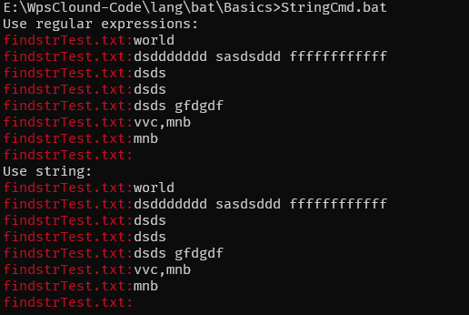

# 解释器：cmd

选项：

- `/A`：将内部命令输出的格式设置为管道或文件(ANSI) 。
- `/Q`：关闭echo。
- `/K`或则`/C`：执行字符串指定的命令然后终止。

# 符号

## 命令回显屏蔽：`@`

### Example

命令不使用`@`符号：

`Test.bat`：

```bat
echo xxx
echo yyy
```

运行输出：

```cmd
C:\Users\pc-2020-4-20\Desktop>C:\Users\pc-2020-4-20\Desktop\Test.bat

C:\Users\pc-2020-4-20\Desktop>echo xxx
xxx

C:\Users\pc-2020-4-20\Desktop>echo yyy
yyy

C:\Users\pc-2020-4-20\Desktop>
```

-----------------

命令使用`@`符号：

`Test.bat`：

```bat
@echo xxx
@echo yyy
```

运行输出：

```cmd
C:\Users\pc-2020-4-20\Desktop>C:\Users\pc-2020-4-20\Desktop\Test.bat
xxx
yyy

C:\Users\pc-2020-4-20\Desktop>
```

## 批处理变量引导符：`%`

## 命令管道符：`|`

## 转移字符：`^`

## 字符串界定符：`""`

## 组合命令：`&` `&&` `||`

```bat
echo 1 & echo 2
```

## 重定向：`>` `>>`

重定向的使用：

- 输入`<`。
- 输出`>`。`>`覆盖，`>>`追加。
- 标准输入`0`、标准输出`1`、错误输出`2`。

### Examples

#### 标准输出重定向到文件，覆盖

```bat
@echo off
setlocal

@REM 覆盖写文件，只有最后一次写的数字。
@REM 这里是将标准输出重定向到了"overlap.txt"文件。
echo %RANDOM% >overlap.txt
echo %RANDOM% >overlap.txt
echo %RANDOM% >overlap.txt
echo %RANDOM% >overlap.txt

endlocal
```

运行输出：

```cmd
E:\WpsClound-Code\lang\bat\IO>Redirect.bat

E:\WpsClound-Code\lang\bat\IO>type overlap.txt
25969

```

#### 标准输出重定向到文件，追加

```bat
@echo off
setlocal

@REM 追加内容在文件末尾。
@REM 这里是将标准输出重定向到了"append.txt"文件。 
echo %RANDOM% >>append.txt
echo %RANDOM% >>append.txt
echo %RANDOM% >>append.txt
echo %RANDOM% >>append.txt

endlocal
```

运行结果：

```cmd
E:\WpsClound-Code\lang\bat\IO>Redirect.bat

E:\WpsClound-Code\lang\bat\IO>type Text.txt
First Line
First Line
First Line
First Line
First Line
First Line
First Line
First Line
First Line
First Line
First Line
First Line

```

#### 标准输入重定向

```bat
@echo off
setlocal

set /p var1="请输入: "
echo "输入为: %var1%"
@REM 重定向输入为nul，即读取输入时直接返回空
<nul set /p var2="请输入: "
echo "输入为: %var2%"

endlocal
```

运行结果：

```cmd
E:\WpsClound-Code\lang\bat\IO>Redirect.bat
请输入: jj
"输入为: jj"
请输入: "输入为: "

```

#### 标准错误重定向

```bat
@echo off
setlocal

@REM 标准输出重定向到nul，错误输出重定向到标准输出，即关闭del命令的所有打印信息。
del xxxxxxxxxx >nul 2>&1

endlocal
```

运行结果：

```cmd
E:\WpsClound-Code\lang\bat\IO>del xxxxxxxxxx
Could Not Find E:\WpsClound-Code\lang\bat\IO\xxxxxxxxxx

E:\WpsClound-Code\lang\bat\IO>Redirect.bat

```

# 命令

## puase

此批处理命令提示用户并等待输入一行内容。

```bat
@echo off
pause
```

## rename

重命名

```bat
@echo off

setlocal
set oldname=template.txt
set newname=new.txt
rename %oldname% %newname%
endlocal

echo "Rename file ok."
pause
```

## cmd中查看文件内容：`type`

`overlap.txt`文件中内容：

```
25969
```

使用`type`命令查看：

```cmd
E:\WpsClound-Code\lang\bat\IO>type overlap.txt
25969

```

# 文件操作

## 获取当前路径

### Example

```bat
@echo off
setlocal

:: 运行脚本时所在的当前路径。
echo %CD%
:: 脚本文件所在路径。
echo %~dp0

endlocal
```

运行结果：

```cmd
E:\WpsClound-Code\lang\bat\IO>CurrentPath.bat
E:\WpsClound-Code\lang\bat\IO
E:\WpsClound-Code\lang\bat\IO\

```

## 检查文件是否存在 ：`exist`

```bat
@echo off
if exist Test.txt copy %CD%\Test.txt "C:\Users\pc-2020-4-20\Desktop\"
pause
```

## 复制文件：`copy`

```bat
@echo off
if exist Test.txt copy %CD%\Test.txt "C:\Users\pc-2020-4-20\Desktop\"
pause
```

## 递归复制文件与文件夹：`xcopy`

### Example

```bat
cd /d %~dp0

@echo off
setlocal

set targetDir=D:\Program Files (x86)\PHOENIX CONTACT Software\MULTIPROG 5.51 Express Build 396\
set pa=..\
set testdir="%targetDir%\plc\"
set testdir2=%testdir%

echo %testdir2%
xcopy %pa% %testdir2% /Y

endlocal
pause
```

运行结果：

`%pa%`目录下的文件与文件夹复制到`D:\Program Files (x86)\PHOENIX CONTACT Software\MULTIPROG 5.51 Express Build 396\plc`文件夹。

## 相对路径转换为绝对路径

脚本所在路径：`C:\Users\pc-2020-4-20\Desktop\test.bat`

```bat
@echo off
set "relativePath=..\xx"
for %%i in ("%relativePath%") do (
    set "absolutePath=%%~fi"
)
echo %absolutePath%
pause
```

输出：

```
C:\Users\pc-2020-4-20\xx
请按任意键继续. . .
```

## 读取文件中的内容

### Example

```bat
@echo off
SETLOCAL EnableDelayedExpansion

echo First Line >Text.txt
echo First Line >>Text.txt
echo First Line >>Text.txt
echo First Line >>Text.txt
echo First Line >>Text.txt
echo First Line >>Text.txt
echo First Line >>Text.txt
echo First Line >>Text.txt
echo First Line >>Text.txt
echo First Line >>Text.txt
echo First Line >>Text.txt
echo First Line >>Text.txt

@REM 每次读取一行。
FOR /F "tokens=*" %%i IN (Text.txt) DO (
    echo %%i
)

ENDLOCAL
```

运行结果：

```cmd
E:\WpsClound-Code\lang\bat\IO>ReadFile.bat
First Line
First Line
First Line
First Line
First Line
First Line
First Line
First Line
First Line
First Line
First Line
First Line

```

## 相对路径转换位绝对路径

```bat
:ConvertPathRelToAbs
setlocal
set REF_PATH=%1
set REL_PATH=%2
for %%I in ("%REF_PATH%%REL_PATH%") do set ABS_PATH=%%~fI
endlocal & set "%3=%ABS_PATH%"
goto :eof
```

描述：将相对路径转换为绝对路径。

参数：

- `%1` [in]: 参考路径，相对路径的参考路径。（绝对路径）
- `%2` [in]: 相对路径，相对于参考路径。 
- `%3` [out]: 返回绝对路径。

### Example

```bat
@echo off

setlocal
set CUR_PATH=%~dp0
set REL_PATH=..\
echo CUR_PATH=%CUR_PATH%
echo REL_PATH=%REL_PATH%
call :ConvertPathRelToAbs %CUR_PATH% %REL_PATH% ABS_PATH
echo ABS_PATH=%ABS_PATH%
endlocal
goto :eof

:ConvertPathRelToAbs
setlocal
set REF_PATH=%1
set REL_PATH=%2
for %%I in ("%REF_PATH%%REL_PATH%") do set ABS_PATH=%%~fI
endlocal & set "%3=%ABS_PATH%"
goto :eof

```

运行结果：

```cmd
C:\Users\pxy\Desktop\Tmp>Test.bat
CUR_PATH=C:\Users\pxy\Desktop\Tmp\
REL_PATH=..\
ABS_PATH=C:\Users\pxy\Desktop\

```

## Windows路径转换为Linux路径

```bat
:ConvertPathWindowsToLinux
setlocal enabledelayedexpansion
set _WINDOWS_PATH=%1
set _LINUX_PATH=!_WINDOWS_PATH:\=/!
endlocal & set "%2=%_LINUX_PATH%"
goto :eof 
```

描述：将`Windows`路径转换为`Linux`路径。

参数：

- `%1` [in]: `Windows`路径。
- `%2 [out]`: 返回`Linux`路径。

### Example

```bat
@echo off

setlocal
set WINDOWS_PATH=%~dp0
echo WINDOWS_PATH=%WINDOWS_PATH%
call :ConvertPathWindowsToLinux %WINDOWS_PATH% LINUX_PATH
echo LINUX_PATH=%LINUX_PATH%
endlocal
goto :eof

:ConvertPathWindowsToLinux
setlocal enabledelayedexpansion
set _WINDOWS_PATH=%1
set _LINUX_PATH=!_WINDOWS_PATH:\=/!
endlocal & set "%2=%_LINUX_PATH%"
goto :eof 

```

运行结果：

```cmd
C:\Users\pxy\Desktop\Tmp>Test.bat
WINDOWS_PATH=C:\Users\pxy\Desktop\Tmp\
LINUX_PATH=C:/Users/pxy/Desktop/Tmp/

```

# 注册表

## 1

注册MultiProgAddIn

```bat
@echo off
setlocal
set Path=C:\Windows\Microsoft.NET\Framework\v4.0.30319
set Dir=C:\Program Files (x86)\PHOENIX CONTACT Software\MULTIPROG 5.51 Express Build 396\
regasm.exe "%Dir%MultiProgAddIn.dll"
endlocal
pause
```

# 变量

## 预定义变量

### 当前路径：CD

脚本所在路径：`C:\Users\pc-2020-4-20\Desktop\test.bat`

```bat
@echo off
echo %CD%
pause
```

运行输出：

```
C:\Users\pc-2020-4-20\Desktop>test.bat
C:\Users\pc-2020-4-20\Desktop

```

### 环境变量PATH：PATH

```cmd
> echo %PATH%
...
D:\Program Files (x86)\VMware\VMware Workstation\bin\;C:\Windows\system32;C:\Windows;C:\Windows\System32\Wbem;C:\Windows\System32\WindowsPowerShell\v1.0\;C:\Windows\System32\OpenSSH\;C:\Program Files\Git\cmd;D:\Windows Kits\10\Windows Performance Toolkit\
...
```

### 生成随机数：RANDOM

```cmd
E:\WpsClound-Code\lang\bat\IO>echo %RANDOM%
29975

E:\WpsClound-Code\lang\bat\IO>echo %RANDOM%
12881

E:\WpsClound-Code\lang\bat\IO>echo %RANDOM%
1649

```

## 局部变量

```bat
@echo off
set var=1
echo %var%

setlocal
set a=1
echo %a%
endlocal

if defined a echo %a%
if not defined a echo "a is not defined"

pause
```

## 查看已设置的变量：set

```cmd
> set
...
ALLUSERSPROFILE=C:\ProgramData
CommonProgramFiles=C:\Program Files\Common Files
CommonProgramFiles(x86)=C:\Program Files (x86)\Common Files
CommonProgramW6432=C:\Program Files\Common Files
ComSpec=C:\Windows\system32\cmd.exe
DriverData=C:\Windows\System32\Drivers\DriverData
EFC_13048=1
FPS_BROWSER_APP_PROFILE_STRING=Internet Explorer
FPS_BROWSER_USER_PROFILE_STRING=Default
HALCONARCH=x64-win64
HOMEDRIVE=C:
...
```

## 变量展开

变量延迟展开：`EnableDelayedExpansion`。

### Example：变量延迟展开

```bat
@echo off

SETLOCAL
set a=4
set a=5 & echo a=%a%
ENDLOCAL

@REM 开启变量延迟展开
SETLOCAL EnableDelayedExpansion
set a=4
@REM 使用!替换%，固定格式。
set a=5 & echo a=!a!
ENDLOCAL
```

运行结果：

```cmd
E:\WpsClound-Code\lang\bat\Basics>EnableDelayedExpansion.bat
a=4
a=5

```

## 扩充变量语法

扩充变量语法详解（选项语法，如`for`）：

| 扩充变量    | 描述                                                         |
| :---------- | :----------------------------------------------------------- |
| `%~I`       | 删除任何引号(")，扩充`%I`                                    |
| `%~fI`      | 将`%I`扩充到一个完全合格的路径名                             |
| `%~dI`      | 仅将`%I`扩充到一个驱动器号                                   |
| `%~pI`      | 仅将`%I`扩充到一个路径                                       |
| `%~nI`      | 仅将`%I`扩充到一个文件名                                     |
| `%~xI`      | 仅将`%I`扩充到一个文件扩展名                                 |
| `%~sI`      | 扩充的路径只含有短名                                         |
| `%~aI`      | 将`%I`扩充到文件的文件属性                                   |
| `%~tI`      | 将`%I`扩充到文件的日期/时间                                  |
| `%~zI`      | 将`%I`扩充到文件的日期/时间                                  |
| `%~$PATH:I` | 查找列在路径环境变量的目录，并`%%I`扩充到找到的第一个完全合格的名称。<br />如果变量名未被定义，或者没有找到文件，此组合键会扩充到空字符串。 |

可以组合修饰符来得到多重结果：

| 扩充变量      | 描述                                                         |
| :------------ | :----------------------------------------------------------- |
| `%~dpI`       | 仅将`%I`扩充到一个驱动器号和路径                             |
| `%~nxI`       | 仅将`%I`扩充到一个文件名和扩展名                             |
| `%~fsI`       | 仅将`%I`扩充到一个带有短名的完整路径名                       |
| `%~dp$PATH:I` | 查找列在路径环境变量的目录，并将`%I`扩充到找到的第一个驱动器号和路径 |
| `%~ftzaI`     | 将`%I`扩充到类似DIR命令                                      |

### Example

```bat
@echo off

setlocal

@REM 命令行的第一个参数，为脚本文件的文件名称。
echo %%0 = %0
echo %%~0 = %~0
echo %%~f0 = %~f0
echo %%~d0 = %~d0
echo %%~p0 = %~p0
echo %%~n0 = %~n0
echo %%~x0 = %~x0
echo %%~s0 = %~s0
echo %%~a0 = %~a0
echo %%~t0 = %~t0
echo %%~z0 = %~z0

echo %%1 = %1
echo %%~$PATH:0 = %~$PATH:0
echo %%~$PATH:1 = %~$PATH:1

echo %%~dp0 = %~dp0 
echo %%~nx0 = %~nx0
echo %%~fs0 = %~fs0

echo %%1 = %1
echo %%~dp$PATH:0 = %~dp$PATH:0
echo %%~dp$PATH:1 = %~dp$PATH:1

echo %%~ftza0 = %~ftza0

endlocal
```

运行结果：

```cmd
E:\WpsClound-Code\lang\bat\Basics>ExtensionVariableSyntax.bat
%0 = ExtensionVariableSyntax.bat
%~0 = ExtensionVariableSyntax.bat
%~f0 = E:\WpsClound-Code\lang\bat\Basics\ExtensionVariableSyntax.bat
%~d0 = E:
%~p0 = \WpsClound-Code\lang\bat\Basics\
%~n0 = ExtensionVariableSyntax
%~x0 = .bat
%~s0 = E:\WpsClound-Code\lang\bat\Basics\ExtensionVariableSyntax.bat
%~a0 = --a--------
%~t0 = 2022/03/10 22:29
%~z0 = 1919
%1 =
%~$PATH:0 =
%~$PATH:1 =
%~dp0 = E:\WpsClound-Code\lang\bat\Basics\
%~nx0 = ExtensionVariableSyntax.bat
%~fs0 = E:\WpsClound-Code\lang\bat\Basics\ExtensionVariableSyntax.bat
%1 =
%~dp$PATH:0 =
%~dp$PATH:1 =
%~ftza0 = --a-------- 2022/03/10 22:29 1919 E:\WpsClound-Code\lang\bat\Basics\ExtensionVariableSyntax.bat

```

# 函数

## Example

- 在脚本中定义函数。
- 在脚本中调用函数。
- 在脚本中为函数传递参数。

```bat
@echo off

setlocal

echo "Function Test"
echo "call SubFunc Start with Param("xxxxx")"
call :SubFunc xxxxx
echo "call end"
@REM 可防止cmd窗口立即退出。
goto :eof

:SubFunc
echo "This is SubFunc"
@REM 第一个参数，标签名称
echo %%0 = "%0"
@REM 第二个参数，调用时传递的参数
echo %%1 = "%1"
@REM 返回"call"调用处。

goto :eof

endlocal
```

运行结果：

```cmd
E:\WpsClound-Code\lang\bat\Function>Function.bat
"Function Test"
"call SubFunc Start with Param("xxxxx")"
"This is SubFunc"
%0 = ":SubFunc"
%1 = "xxxxx"
"call end"

```

## 返回值

### 无返回值使用`goto :eof`

```bat
@echo off

setlocal
call :SubFunc
echo ErrorLevel=%ERRORLEVEL%
endlocal
goto :eof

:SubFunc
goto :eof 1

```

运行结果：

```cmd
C:\Users\pxy\Desktop\Tmp>Test.bat
ErrorLevel=0

```

> [!IMPORTANT]
>
> `goto :eof`无法设置返回值。

### 有返回值使用`exit /b xx`

```bat
@echo off

setlocal
call :SubFunc
echo ErrorLevel=%ERRORLEVEL%
endlocal
goto :eof

:SubFunc
exit /b 1

```

运行结果：

```cmd
C:\Users\pxy\Desktop\Tmp>Test.bat
ErrorLevel=1

```

## 返回数据

通过参数返回数据。

```bat
@echo off

setlocal
call :Add 3 5 result
echo Result=%result%
endlocal
goto :eof

:Add
setlocal
set /a %tmp=%1 + %2
endlocal & set "%3=%tmp%"
goto :eof

```
运行结果：

```cmd
C:\Users\pxy\Desktop\Tmp>Test.bat
Result=8

```

> [!IMPORTANT]
>
> 注意`setlocal/endlocal`，`endlocal`后`setlocal/endlocal`中的局部变量会失效，不要在`setlocal/endlocal`返回局部变量的值。

# 字符串处理

## 移除字符串双引号

`RemoveStringQuotation.bat`

```bat
@echo off

setlocal
echo %0
echo %1
set var=%1
set "var=%var:"=%"
echo %var%

IF %1%=="test" (
echo equal
) ELSE (
echo not
)

endlocal
```

运行`.\\RemoveStringQuotation.bat "test"`：

```
RemoveStringQuotation.bat
"test"
test
equal

```

## `findstr`

选项：

|选项|描述|
|:---|:---|
| `/v` | 打印不包含指定字符串的行 |
| `/a` | 可以指定打印的颜色，颜色参考color命令 |
| `/R` | 正则表达式 |

### Example

```bat
@echo off
setlocal

@REM findstr
@REM /v: 打印不包含指定字符串的行。
@REM /a: 可以指定打印的颜色，颜色参考color命令。
@REM /R: 正则表达式。
@REM nul，对应文件，这里只是为了显示颜色，单个查找文件不会打印颜色
echo Use regular expressions:
findstr /v /a:04 /R ".*hello.*" "findstrTest.txt" nul
echo Use string:
findstr /v /a:04 /L "hello" "findstrTest.txt" nul

endlocal
```

`findstrTest.txt`文件内容：

```
hello
world
dsddddddd sasdsddd ffffffffffff
dsds
dsds
dsds gfdgdf
vvc,mnb
mnb


```

运行结果：

