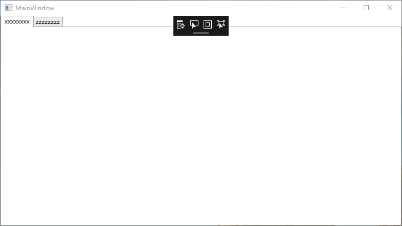
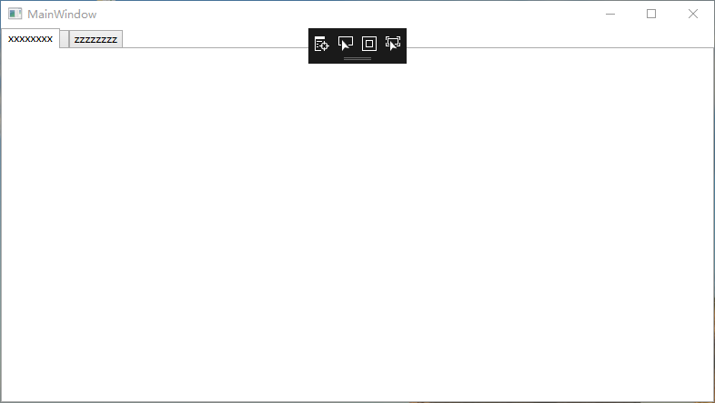
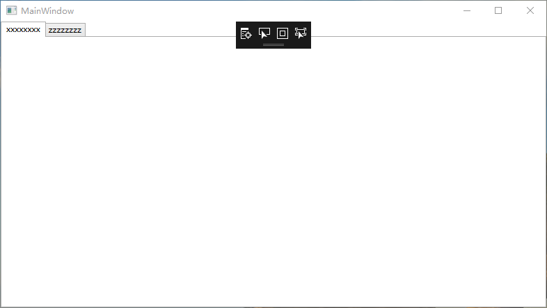
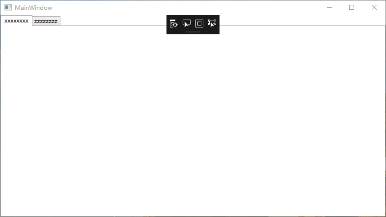

# IValueConverter

## Demo : TabControlTest

- BoolToVisibilityConverter.cs，参考"常用转换/BoolToVisibilityConverter"

- MainViewModel.cs

  ```c#
  using System;
  using System.Collections.Generic;
  using System.ComponentModel;
  using System.Linq;
  using System.Text;
  using System.Threading.Tasks;
  
  namespace TabControlTest
  {
      public class MainViewModel
      {
          public class TestClass : INotifyPropertyChanged
          {
              private bool? _isShow;
  
              public bool? IsShow
              {
                  get { return _isShow; }
                  set
                  {
                      if (_isShow == value)
                      {
                          return;
                      }
  
                      _isShow = value;
                      RaisePropertyChanged("IsShow");
                  }
              }
  
              private string _text;
  
              public event PropertyChangedEventHandler PropertyChanged;
  
              public void RaisePropertyChanged(string propertyName)
              {
                  if (PropertyChanged != null)
                  {
                      PropertyChanged.Invoke(this, new PropertyChangedEventArgs(propertyName));
                  }
              }
  
              public string Text
              {
                  get { return _text; }
                  set { _text = value; }
              }
          }
  
          public TestClass Test { get; set; }
      }
  }
  
  ```

- MainWindow.xaml

  - MainViewModel.xaml.cs

    ```c#
    using System;
    using System.Collections.Generic;
    using System.Linq;
    using System.Text;
    using System.Threading.Tasks;
    using System.Windows;
    using System.Windows.Controls;
    using System.Windows.Data;
    using System.Windows.Documents;
    using System.Windows.Input;
    using System.Windows.Media;
    using System.Windows.Media.Imaging;
    using System.Windows.Navigation;
    using System.Windows.Shapes;
    
    namespace TabControlTest
    {
        /// <summary>
        /// MainWindow.xaml 的交互逻辑
        /// </summary>
        public partial class MainWindow : Window
        {
            public MainWindow()
            {
                InitializeComponent();
                MainVM = new MainViewModel();
                MainVM.Test = new MainViewModel.TestClass();
                MainVM.Test.IsShow = false;
                MainVM.Test.Text = "Hello";
                DataContext = MainVM;
            }
    
            private MainViewModel _mainVM;
    
            public MainViewModel MainVM
            {
                get { return _mainVM; }
                set { _mainVM = value; }
            }
    
            private void Button_Click(object sender, RoutedEventArgs e)
            {
                MainVM.Test.IsShow = !MainVM.Test.IsShow;
            }
        }
    }
    ```

  - MainViewModel.xaml

    ```xaml
    <Window x:Class="TabControlTest.MainWindow"
            xmlns="http://schemas.microsoft.com/winfx/2006/xaml/presentation"
            xmlns:x="http://schemas.microsoft.com/winfx/2006/xaml"
            xmlns:d="http://schemas.microsoft.com/expression/blend/2008"
            xmlns:mc="http://schemas.openxmlformats.org/markup-compatibility/2006"
            xmlns:local="clr-namespace:TabControlTest"
            mc:Ignorable="d"
            Title="MainWindow" Height="450" Width="800">
    
        <Window.Resources>
            <local:BoolToVisibilityConverter x:Key="BoolToVisibilityConverter"/>
        </Window.Resources>
        
        <Grid>
            <TabControl>
                <TabItem Header="xxxxxxxx"/>
                <TabItem Header="{Binding Test.Text} Visibility={Binding Test.IsShow, Converter={StaticResource BoolToVisibilityConverter}}" />
                <TabItem Header="zzzzzzzz"/>
            </TabControl>
        </Grid>
    </Window>
    ```

属性的Binding形式为"Test.IsShow"。

### Binding的属性的所属对象不为null

- MainViewModel.xaml

  ```xaml
  ...
              <TabItem Header="{Binding Test.Text} Visibility={Binding Test.IsShow, Converter={StaticResource BoolToVisibilityConverter}}" />
  ...
  ```

- MainViewModel.xaml.cs

  ```c#
  ...
  		public MainWindow()
          {
              InitializeComponent();
              MainVM = new MainViewModel();
              MainVM.Test = new MainViewModel.TestClass();
              MainVM.Test.IsShow = false;
              MainVM.Test.Text = "Hello";
              DataContext = MainVM;
          }
  ...
  ```

运行结果：



### Binding的属性的所属对象为null

- MainViewModel.xaml

  ```xaml
  ...
              <TabItem Header="{Binding Test.Text} Visibility={Binding Test.IsShow, Converter={StaticResource BoolToVisibilityConverter}}" />
  ...
  ```

- MainViewModel.xaml.cs

  ```c#
  ...
  		public MainWindow()
          {
              InitializeComponent();
              MainVM = new MainViewModel();
              DataContext = MainVM;
          }
  ...
  ```

运行结果：



## Note

1. 在进行`Binding`的时，Path为`Obj.Prrperty`，如果**Obj为null**，不会进行Binding转换，而会使用控件属性的默认值。

# IMultiValueConverter

## Demo : TabControlTest

- BoolToVisibilityConverter.cs，参考"常用转换/BoolToVisibilityMultiBindingConverter"

- MainViewModel.cs

  ```c#
  using System;
  using System.Collections.Generic;
  using System.ComponentModel;
  using System.Linq;
  using System.Text;
  using System.Threading.Tasks;
  
  namespace TabControlTest
  {
      public class MainViewModel
      {
          public class TestClass : INotifyPropertyChanged
          {
              private bool? _isShow;
  
              public bool? IsShow
              {
                  get { return _isShow; }
                  set
                  {
                      if (_isShow == value)
                      {
                          return;
                      }
  
                      _isShow = value;
                      RaisePropertyChanged("IsShow");
                  }
              }
  
              private string _text;
  
              public event PropertyChangedEventHandler PropertyChanged;
  
              public void RaisePropertyChanged(string propertyName)
              {
                  if (PropertyChanged != null)
                  {
                      PropertyChanged.Invoke(this, new PropertyChangedEventArgs(propertyName));
                  }
              }
  
              public string Text
              {
                  get { return _text; }
                  set { _text = value; }
              }
          }
  
          public TestClass Test { get; set; }
      }
  }
  
  ```

- MainWindow.xaml

  - MainViewModel.xaml.cs

    ```c#
    using System;
    using System.Collections.Generic;
    using System.Linq;
    using System.Text;
    using System.Threading.Tasks;
    using System.Windows;
    using System.Windows.Controls;
    using System.Windows.Data;
    using System.Windows.Documents;
    using System.Windows.Input;
    using System.Windows.Media;
    using System.Windows.Media.Imaging;
    using System.Windows.Navigation;
    using System.Windows.Shapes;
    
    namespace TabControlTest
    {
        /// <summary>
        /// MainWindow.xaml 的交互逻辑
        /// </summary>
        public partial class MainWindow : Window
        {
            public MainWindow()
            {
                InitializeComponent();
                MainVM = new MainViewModel();
                MainVM.Test = new MainViewModel.TestClass();
                MainVM.Test.IsShow = false;
                MainVM.Test.Text = "Hello";
                DataContext = MainVM;
            }
    
            private MainViewModel _mainVM;
    
            public MainViewModel MainVM
            {
                get { return _mainVM; }
                set { _mainVM = value; }
            }
    
            private void Button_Click(object sender, RoutedEventArgs e)
            {
                MainVM.Test.IsShow = !MainVM.Test.IsShow;
            }
        }
    }
    ```

  - MainViewModel.xaml

    ```xaml
    <Window x:Class="TabControlTest.MainWindow"
            xmlns="http://schemas.microsoft.com/winfx/2006/xaml/presentation"
            xmlns:x="http://schemas.microsoft.com/winfx/2006/xaml"
            xmlns:d="http://schemas.microsoft.com/expression/blend/2008"
            xmlns:mc="http://schemas.openxmlformats.org/markup-compatibility/2006"
            xmlns:local="clr-namespace:TabControlTest"
            mc:Ignorable="d"
            Title="MainWindow" Height="450" Width="800">
    
        <Window.Resources>
            <local:BoolToVisibilityConverter x:Key="BoolToVisibilityConverter"/>
        </Window.Resources>
        
        <Grid>
            <TabControl>
                <TabItem Header="xxxxxxxx"/>
               <TabItem Header="{Binding Test.Text}">
                    <TabItem.Visibility>
                        <MultiBinding Converter="{StaticResource BoolToVisibilityMultiBindingConverter}">
                            <Binding Path="Test"/>
                            <Binding Path="Test.IsShow"/>
                        </MultiBinding>
                    </TabItem.Visibility>
                </TabItem>
                <TabItem Header="zzzzzzzz"/>
            </TabControl>
        </Grid>
    </Window>
    ```

### Binding的属性的所属对象不为null

- MainViewModel.xaml

  ```xaml
  ...
             <TabItem Header="{Binding Test.Text}">
                  <TabItem.Visibility>
                      <MultiBinding Converter="{StaticResource BoolToVisibilityMultiBindingConverter}">
                          <Binding Path="Test"/>
                          <Binding Path="Test.IsShow"/>
                      </MultiBinding>
                  </TabItem.Visibility>
              </TabItem>
  ...
  ```

- MainViewModel.xaml.cs

  ```c#
  ...
  		public MainWindow()
          {
              InitializeComponent();
              MainVM = new MainViewModel();
              MainVM.Test = new MainViewModel.TestClass();
              MainVM.Test.IsShow = false;
              MainVM.Test.Text = "Hello";
              DataContext = MainVM;
          }
  ...
  ```

运行结果：



### Binding的属性的所属对象为null

- MainViewModel.xaml

  ```xaml
  ...
             <TabItem Header="{Binding Test.Text}">
                  <TabItem.Visibility>
                      <MultiBinding Converter="{StaticResource BoolToVisibilityMultiBindingConverter}">
                          <Binding Path="Test"/>
                          <Binding Path="Test.IsShow"/>
                      </MultiBinding>
                  </TabItem.Visibility>
              </TabItem>
  ...
  ```

- MainViewModel.xaml.cs

  ```c#
  ...
  		public MainWindow()
          {
              InitializeComponent();
              MainVM = new MainViewModel();
              DataContext = MainVM;
          }
  ...
  ```

运行结果：




## Note

1. 在进行`Binding`的时，Path为`Obj.Prrperty`，如果**Obj为null**，使用MultiBinding的转换，可解决Obj为null，属性值无效（控制器使用控件属性的默认值）的问题。

# 常用转换

| 转换器名称                            | SourceType     | TargetType |
| ------------------------------------- | -------------- | ---------- |
| BoolToVisibilityConverter             | bool           | Visibility |
| BoolToVisibilityMultiBindingConverter | object<b/>bool |            |
|                                       |                |            |

## BoolToVisibilityConverter

```c#
using System;
using System.Windows;
using System.Windows.Data;

namespace Converter
{
    /// <summary>
    /// bool类型的值转换为<see cref="Visibility"/>类型。
    /// </summary>
    /// <seealso cref="IValueConverter"/>
    [ValueConversion(typeof(bool), typeof(Visibility))]
    public class BoolToVisibilityConverter : IValueConverter
    {
        /// <summary> 
        /// bool类型的值转换为<see cref="Visibility"/>类型。
        /// </summary> 
        /// <param name="value">The value produced by the binding source.</param> 
        /// <param name="targetType">The type of the binding target property.</param> 
        /// <param name="parameter">The converter parameter to use.</param> 
        /// <param name="culture">The culture to use in the converter.</param> 
        /// <returns> 
        ///     <para>value为null，parameter为"Visibility"类型，返回parameter。</para>
        ///     <para>value为null，parameter为null或则parameter不是"Visibility"类型，返回"Visibility.Collapsed"。</para>
        ///     <para>value为true，targetType为"Visibility"类型，返回"Visibility.Visible"。</para>
        ///     <para>value为false，targetType为"Visibility"类型，parameter为"Visibility"类型，返回parameter。</para>
        ///     <para>value为false，targetType为"Visibility"类型，
        ///     parameter为null或则parameter不是"Visibility"类型，返回"Visibility.Collapsed"。</para>
        ///     <para>其余情况返回"Visibility.Visible"。</para>
        /// </returns> 
        public object Convert(object value, Type targetType, object parameter, System.Globalization.CultureInfo culture)
        {
            Console.WriteLine("Convert...");

            if (value is bool && targetType == typeof(Visibility))
            {
                bool val = (bool)value;
                if (val)
                {
                    return Visibility.Visible;
                }
                else
                {
                    if (parameter != null && parameter is Visibility)
                    {
                        return parameter;
                    }
                    else
                    {
                        return Visibility.Collapsed;
                    }
                }
            }

            if (value == null)
            {
                if (parameter != null && parameter is Visibility)
                {
                    return parameter;
                }
                else
                {
                    return Visibility.Collapsed;
                }
            }

            return Visibility.Visible;
        }

        /// <summary> 
        /// 将<see cref="Visibility"/>类型的值转换为bool类型。
        /// </summary> 
        /// <param name="value">The value that is produced by the binding target.</param> 
        /// <param name="targetType">The type to convert to.</param> 
        /// <param name="parameter">The converter parameter to use.</param> 
        /// <param name="culture">The culture to use in the converter.</param> 
        /// <returns> 
        ///     <para>value为"Visibility.Visible"，targetType是bool类型，返回true。</para> 
        ///     <para>value为"Visibility"类型，value不为"Visibility.Visible"，targetType是bool类型，返回false。</para> 
        /// </returns>
        /// <exception cref="ArgumentException">
        ///     <para>1. value不是"Visibility"类型。</para>
        ///     <para>2. targetType不是bool类型。</para>
        /// </exception>
        public object ConvertBack(object value, Type targetType, object parameter, System.Globalization.CultureInfo culture)
        {
            if (value is Visibility && targetType == typeof(bool))
            {
                Visibility val = (Visibility)value;
                if (val == Visibility.Visible)
                {
                    return true;
                }
                else
                {
                    return false;
                }
            }

            throw new ArgumentException("Invalid argument/return type. Expected argument: Visibility and return type: bool");
        }
    }
}
```

## BoolToVisibilityMultiBindingConverter

```c#
using System;
using System.Collections.Generic;
using System.Globalization;
using System.Linq;
using System.Text;
using System.Threading.Tasks;
using System.Windows;
using System.Windows.Data;

namespace TabControlTest
{
    public class BoolToVisibilityMultiBindingConverter : IMultiValueConverter
    {
        public object Convert(object[] values, Type targetType, object parameter, CultureInfo culture)
        {
            //throw new NotImplementedException();
            if (values[0] == null)
            {
                return Visibility.Collapsed;
            }

            var value = values[1];
            if (value is bool && targetType == typeof(Visibility))
            {
                bool val = (bool)value;
                if (val)
                {
                    return Visibility.Visible;
                }
                else
                {
                    if (parameter != null && parameter is Visibility)
                    {
                        return parameter;
                    }
                    else
                    {
                        return Visibility.Collapsed;
                    }
                }
            }

            if (value == null)
            {
                if (parameter != null && parameter is Visibility)
                {
                    return parameter;
                }
                else
                {
                    return Visibility.Collapsed;
                }
            }

            return Visibility.Visible;
        }

        public object[] ConvertBack(object value, Type[] targetTypes, object parameter, CultureInfo culture)
        {
            throw new NotImplementedException();
        }
    }
}

```


