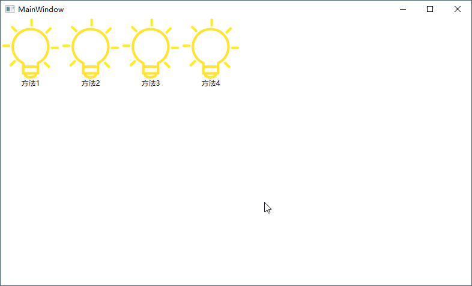

# 为Image设置图片的方法

## 在Xaml中使用绝对Pack URI

### 使用程序集中的图片

#### 图片的编译方法

- 图片编译为"Resource"，图片编译为Resource时并不会复制图片。
- 图片也可编译为"Content"，并且可以复制图片（手动复制、自动复制都可以）。

#### 使用本程序集中的图片

```
"pack://application:,,,/Subfolder/image.png"
```

#### 使用外部程序集的图片

```
"pack://application:,,,/ReferencedAssembly;component/Subfolder/image.png"
```

#### 易用性

- 优点：图片直接添加为"资源"。图片编译选项为"Content"时，替换图片不用重新编译程序集。

- 缺点：图片编译为"Resource"时，图片变更时需要重新编译程序集。图片编译为"Content"时，这种情况程序集的运行路径不是程序集文件的实际路径时，会导致找不到图片

### 使用外部图片

#### 图片的编译方法

- 图片无需编译。
- 复制可根据需要进行设置。如需编译时复制，则设置"较新时复制"；如果手动复制，则设置"不复制"。

#### 使用方法

```
"pack://siteoforigin:,,,/Subfolder/image.png"
```

#### 易用性

- 优点：简单，修改图片时无需重新编译程序集。
- 缺点：测试发现只能使用相对程序集的路径。

## 在Xaml中使用相对路径

### 图片的编译方法

- 图片编译为"Resource"，图片编译为Resource时并不会复制图片。
- 图片也可编译为"Content"，并且可以复制图片（手动复制、自动复制都可以）。

### 使用方法

```
"/Subfolder/image.png"
```

### 易用性

- 优点：图片直接添加为"资源"。图片编译选项为"Content"时，替换图片不用重新编译程序集。

- 缺点：图片编译为"Resource"时，图片变更时需要重新编译程序集。图片编译为"Content"时，这种情况程序集的运行路径不是程序集文件的实际路径时，会导致找不到图片

## Xaml中Binding数据对象，在cs代码中会出ImageSource

### 图片的编译方法

- 图片无需编译。
- 复制可根据需要进行设置。如需编译时复制，则设置"较新时复制"；如果手动复制，则设置"不复制"。

### 使用方法

- 在Xaml代码中直接Binding数据对象即可。

### 易用性

- 优点：简单，修改图片时无需重新编译程序集。
- 缺点：需要写CS代码。

## 例子

### Xaml

- 文件名称MainWindow.xaml。

```xaml
<Window x:Class="ImageTest.MainWindow"
        xmlns="http://schemas.microsoft.com/winfx/2006/xaml/presentation"
        xmlns:x="http://schemas.microsoft.com/winfx/2006/xaml"
        xmlns:d="http://schemas.microsoft.com/expression/blend/2008"
        xmlns:mc="http://schemas.openxmlformats.org/markup-compatibility/2006"
        xmlns:local="clr-namespace:ImageTest"
        mc:Ignorable="d"
        Title="MainWindow" Height="450" Width="800">
    <Grid>
        <WrapPanel Orientation="Horizontal">
            <!--方法1，图片的编译方法为Rescource，编译为Resource时不会复制图片，如需更改图片需要重新编译程序集。
                注意：如果需要复制图片，图片的编译方为Content，并且复制图片。使用相对路径，如果运行路径不是实际路径，会导致找不到图片。-->
            <StackPanel Orientation="Vertical">
                <Image Width="100" Height="100" Source="pack://application:,,,/Images/Bulb.png" />
                <TextBlock Text="方法1" HorizontalAlignment="Center" VerticalAlignment="Center"/>
            </StackPanel>

            <!--方法2，图片的编译方法为Resource，编译为Resource时不会复制图片，如需更改图片需要重新编译程序集。
                注意：如果需要复制图片，图片的编译方为Content，并且复制图片。使用相对路径，如果运行路径不是实际路径，会导致找不到图片。-->
            <StackPanel Orientation="Vertical">
                <Image Width="100" Height="100" Source="/Images/Bulb.png" Stretch="Fill"/>
                <TextBlock Text="方法2" HorizontalAlignment="Center" VerticalAlignment="Center"/>
            </StackPanel>

            <!--方法3，只需复制图片即可。-->
            <StackPanel Orientation="Vertical">
                <Image Width="100" Height="100" Source="{Binding ImageSourceX}"/>
                <TextBlock Text="方法3" HorizontalAlignment="Center" VerticalAlignment="Center"/>
            </StackPanel>

            <!--方法4，只需要复制图片即可，使用的是dll文件的相对路径。-->
            <StackPanel Orientation="Vertical">
                <Image Width="100" Height="100" Source="pack://siteoforigin:,,,/Externalimages/Bulb.png"/>
                <TextBlock Text="方法4" HorizontalAlignment="Center" VerticalAlignment="Center"/>
            </StackPanel>
        </WrapPanel>
    </Grid>
</Window>

```

### CS

- 文件名称MainWindow.xaml.cs。

```c#
using System;
using System.Collections.Generic;
using System.Linq;
using System.Text;
using System.Threading.Tasks;
using System.Windows;
using System.Windows.Controls;
using System.Windows.Data;
using System.Windows.Documents;
using System.Windows.Input;
using System.Windows.Media;
using System.Windows.Media.Imaging;
using System.Windows.Navigation;
using System.Windows.Shapes;

namespace ImageTest
{
    /// <summary>
    /// MainWindow.xaml 的交互逻辑
    /// </summary>
    public partial class MainWindow : Window
    {
        public MainWindow()
        {
            InitializeComponent();
            ImageSourceX = ImageManager.DrawBitmapImage();
            DataContext = this;
        }

        public ImageSource ImageSourceX { get; set; }
    }
}

```

- 文件名称ImageManager.cs。

```c#
using System;
using System.Collections.Generic;
using System.Linq;
using System.Text;
using System.Threading.Tasks;
using System.Windows.Media;
using System.Windows.Media.Imaging;

namespace ImageTest
{
    class ImageManager
    {
        /// <summary>
        /// 绘制一张图片。
        /// </summary>
        /// <returns>图片。</returns>
        public static ImageSource DrawBitmapImage()
        {
            BitmapImage bi = null;

            try
            {
                bi = new BitmapImage();
                bi.BeginInit();
                // 注意，这里一定要是DLL或者EXE的路径在加上相对路径，如果直接使用相对路径，有可能找不到图片（运行路径和实际路径不一致）。
                string path = System.IO.Path.GetDirectoryName(System.Reflection.Assembly.GetExecutingAssembly().Location);
                path = System.IO.Path.Combine(path, @"Images/Bulb.png");
                bi.UriSource = new Uri(path, UriKind.RelativeOrAbsolute);
                bi.EndInit();
            }
            catch (System.IO.FileNotFoundException)
            {
                bi = null;
            }
            catch (UriFormatException)
            {
                bi = null;
            }

            return bi;
        }
    }
}

```

### 图片

### 运行结果




