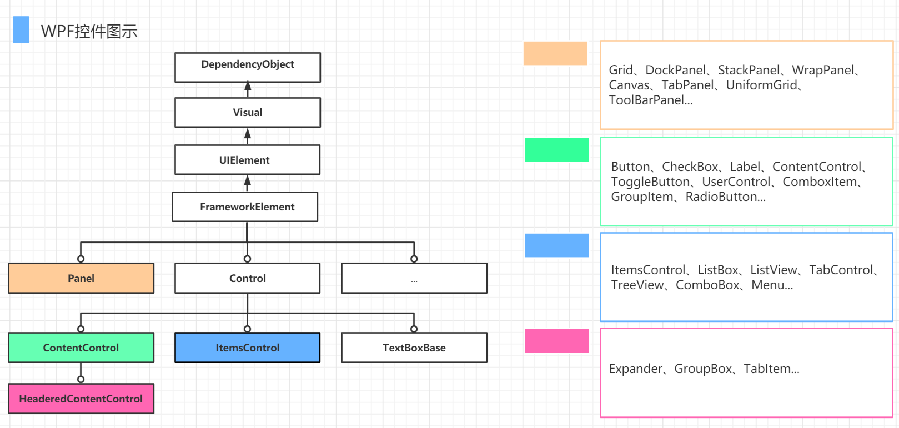
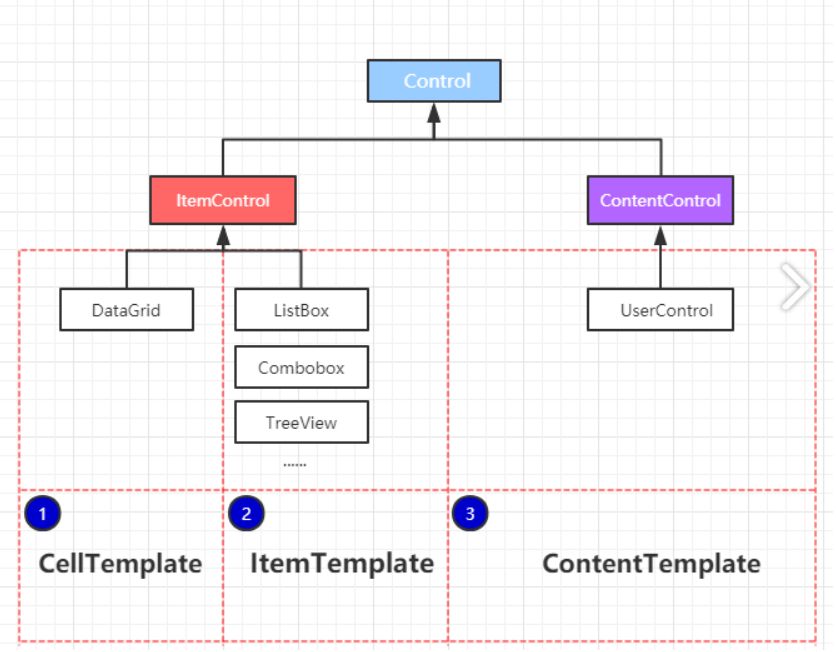
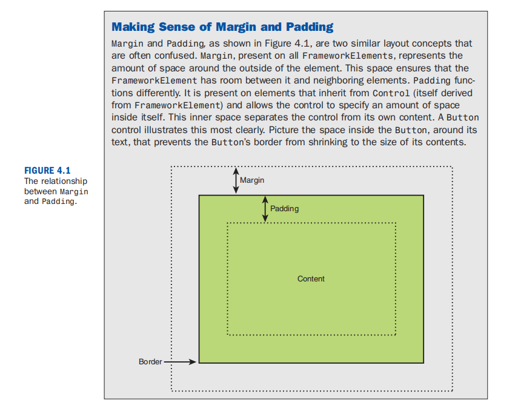

# Control

## WPF控件继承关系



# 2 Command

# Layout

## StackPanel

## DockPanel

## Grid

### `*`表示长宽比例

第二列是第一列的两倍宽

```xaml
        <Grid.ColumnDefinitions>
            <ColumnDefinition Width="*" />
            <ColumnDefinition Width="2*" />
        </Grid.ColumnDefinitions>
```

### `auto`自动调整长宽

第一行自动调整里面包含的控件的默认大小

```xaml
        <Grid.RowDefinitions>
            <RowDefinition Height="auto" />
            <RowDefinition />
        </Grid.RowDefinitions>
```


# 4 Data Binding

# 5 Triggers

# 6 ControlTemplate

# 7 DataTemplate



# 8 Style

# Margin and Padding


