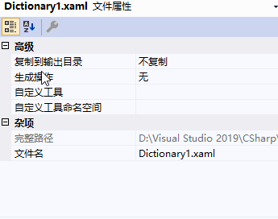
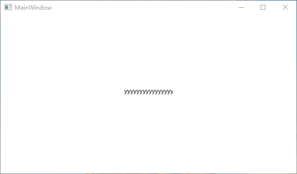
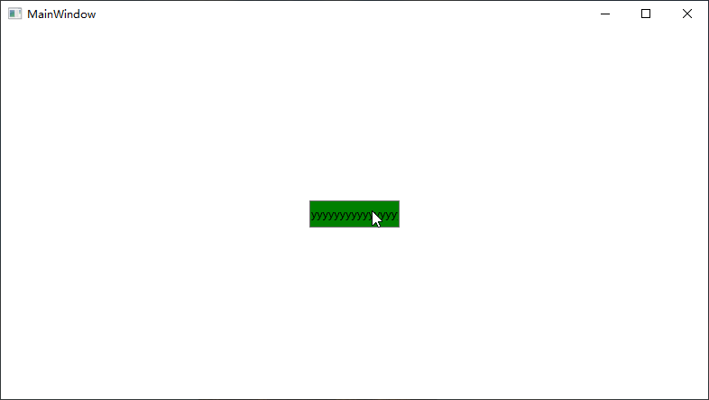

# ResourceDictionay使用

- 创建一个Wpf应用程序

## 定义数据类型

- TestObj.cs

```csharp
namespace MergeXXX
{
    public class TestObjBase
    {
		private string _name;
        
        virtual public string Name
        {
            get { return _name; }
            set { _name = value; }
        }
    }
    
    public class TestObj : TestObjBase
    {
        public override string Name
        {
            get { return base.Name; }
            set { base.Name = value; }
        }
        
        private int myVar;
        
        public int MyProperty
        {
            get { return myVar; }
            set { myVar = value; }
        }
    }
}
```

## 创建资源

- Dictionary1.xaml

```xaml
<ResourceDictionary xmlns="http://schemas.microsoft.com/winfx/2006/xaml/presentation"
                    xmlns:x="http://schemas.microsoft.com/winfx/2006/xaml"
                    xmlns:local="clr-namespace:MergeXXX">

    <DataTemplate DataType="{x:Type local:TestObjBase}">
        <StackPanel>
            <Button Content="{Binding Name}" HorizontalAlignment="Right" VerticalAlignment="Center" Width="100" Height="100" Background="Red"/>
        </StackPanel>
    </DataTemplate>
</ResourceDictionary>
```

## 使用资源

- MainWindow.xaml

```xaml
<Window x:Class="MergeXXX.MainWindow"
        xmlns="http://schemas.microsoft.com/winfx/2006/xaml/presentation"
        xmlns:x="http://schemas.microsoft.com/winfx/2006/xaml"
        xmlns:d="http://schemas.microsoft.com/expression/blend/2008"
        xmlns:mc="http://schemas.openxmlformats.org/markup-compatibility/2006"
        xmlns:local="clr-namespace:MergeXXX"
        mc:Ignorable="d"
        Title="MainWindow" Height="450" Width="800">

    <Window.Resources>
        <ResourceDictionary>
            <ResourceDictionary.MergedDictionaries>
                <ResourceDictionary Source="pack://application:,,,/MergeXXX;component/Dictionary1.xaml"/>
            </ResourceDictionary.MergedDictionaries>
        </ResourceDictionary>
    </Window.Resources>
    
    <Grid>
        <!-- 这里会导致绑定的对象一直向下传递 -->
        <UserControl Content="{Binding}"/>
    </Grid>
</Window>

```

- MainWindow.xaml.cs

```c#
using System;
using System.Collections.Generic;
using System.Linq;
using System.Text;
using System.Threading.Tasks;
using System.Windows;
using System.Windows.Controls;
using System.Windows.Data;
using System.Windows.Documents;
using System.Windows.Input;
using System.Windows.Media;
using System.Windows.Media.Imaging;
using System.Windows.Navigation;
using System.Windows.Shapes;

namespace MergeXXX
{
    /// <summary>
    /// MainWindow.xaml 的交互逻辑
    /// </summary>
    public partial class MainWindow : Window
    {
        public MainWindow()
        {
            InitializeComponent();
            TestObj testObj = new TestObj();
            testObj.Name = "Dictionary Merge Test.";
            DataContext = testObj;
        }
    }
}

```

## 运行结果


# 资源合并注意事项

- 多个资源合并时，先搜索最后一个添加的 ResourceDictionary，并在找到请求的键时就立即停止搜索。即：找到第一个符合项目，就不再查找后面的相识内容。

## 上面的例子中新增内容

- Dictionary2.xaml

```xaml
<ResourceDictionary xmlns="http://schemas.microsoft.com/winfx/2006/xaml/presentation"
                    xmlns:x="http://schemas.microsoft.com/winfx/2006/xaml"
                    xmlns:local="clr-namespace:MergeXXX">

    <DataTemplate DataType="{x:Type local:TestObjBase}">
        <StackPanel>
            <Button Content="{Binding Name}" HorizontalAlignment="Left" VerticalAlignment="Center" Width="100" Height="100" Background="Blue"/>
        </StackPanel>
    </DataTemplate>
</ResourceDictionary>
```

- Dictionary3.xaml

```xaml
<ResourceDictionary xmlns="http://schemas.microsoft.com/winfx/2006/xaml/presentation"
                    xmlns:x="http://schemas.microsoft.com/winfx/2006/xaml"
                    xmlns:local="clr-namespace:MergeXXX">

    <DataTemplate DataType="{x:Type local:TestObjBase}">
        <StackPanel>
            <Button Content="{Binding Name}" HorizontalAlignment="Center" VerticalAlignment="Top" Width="100" Height="100" Background="Green"/>
        </StackPanel>
    </DataTemplate>
</ResourceDictionary>
```

- MainWindow.xaml

```xaml
<Window x:Class="MergeXXX.MainWindow"
        xmlns="http://schemas.microsoft.com/winfx/2006/xaml/presentation"
        xmlns:x="http://schemas.microsoft.com/winfx/2006/xaml"
        xmlns:d="http://schemas.microsoft.com/expression/blend/2008"
        xmlns:mc="http://schemas.openxmlformats.org/markup-compatibility/2006"
        xmlns:local="clr-namespace:MergeXXX"
        mc:Ignorable="d"
        Title="MainWindow" Height="450" Width="800">

    <Window.Resources>
        <ResourceDictionary>
            <ResourceDictionary.MergedDictionaries>
                <ResourceDictionary Source="pack://application:,,,/MergeXXX;component/Dictionary1.xaml"/>
                <ResourceDictionary Source="pack://application:,,,/MergeXXX;component/Dictionary2.xaml"/>
                <ResourceDictionary Source="pack://application:,,,/MergeXXX;component/Dictionary3.xaml"/>
            </ResourceDictionary.MergedDictionaries>
        </ResourceDictionary>
    </Window.Resources>
    
    <Grid>
        <UserControl Content="{Binding}"/>
    </Grid>
</Window>

```

## 运行结果


# 使用外部Xaml文件

- 使用外部Xaml文件，可以通过修改外部Xaml文件修改软件界面的显示，而不需要重新编译工程。

## Xaml

- 文件名称MainWindow.xaml.cs。

```c#
<Window x:Class="CallExternalXamlPage.MainWindow"
        xmlns="http://schemas.microsoft.com/winfx/2006/xaml/presentation"
        xmlns:x="http://schemas.microsoft.com/winfx/2006/xaml"
        xmlns:d="http://schemas.microsoft.com/expression/blend/2008"
        xmlns:mc="http://schemas.openxmlformats.org/markup-compatibility/2006"
        xmlns:local="clr-namespace:CallExternalXamlPage"
        mc:Ignorable="d"
        Title="MainWindow" Height="450" Width="800">

    <Window.Resources>
        <ResourceDictionary>
            <ResourceDictionary.MergedDictionaries>
                <ResourceDictionary Source="pack://siteoforigin:,,,/Resources/Dictionary1.xaml"/>
            </ResourceDictionary.MergedDictionaries>
        </ResourceDictionary>
    </Window.Resources>
    
    <Grid>
        <UserControl Content="{StaticResource yyy}"/>
    </Grid>
</Window>
```

### 被引用的Xaml文件

#### 文件内容

- 文件名称Resources/Dictionary1.xaml，被引用的文件。

```c#
<ResourceDictionary xmlns="http://schemas.microsoft.com/winfx/2006/xaml/presentation"
                    xmlns:x="http://schemas.microsoft.com/winfx/2006/xaml"
                    xmlns:local="clr-namespace:XamlPages">
    
    <TextBlock x:Key="yyy" Text="yyyyyyyyyyyyyyyyyyyy" Width="100" Height="30"/>
    
</ResourceDictionary>
```

#### 文件的编译选项



- 文件不用编译，也不复制，手动将文件及文件所在目录（工程根目录下的子目录）手动复制到程序集文件所在目录即可。

## CS

- 文件名称MainWindow.xaml.cs。

```c#
using System;
using System.Collections.Generic;
using System.Linq;
using System.Text;
using System.Threading.Tasks;
using System.Windows;
using System.Windows.Controls;
using System.Windows.Data;
using System.Windows.Documents;
using System.Windows.Input;
using System.Windows.Media;
using System.Windows.Media.Imaging;
using System.Windows.Navigation;
using System.Windows.Shapes;

namespace CallExternalXamlPage
{
    /// <summary>
    /// MainWindow.xaml 的交互逻辑
    /// </summary>
    public partial class MainWindow : Window
    {
        public MainWindow()
        {
            InitializeComponent();
        }
    }
}

```

## 运行

### 默认运行结果



### 修改被引用的Xaml文件后运行

#### 修改被引用的Xaml文件

- 文件名称为Resources/Dictionary1.xaml。

```xaml
<ResourceDictionary xmlns="http://schemas.microsoft.com/winfx/2006/xaml/presentation"
                    xmlns:x="http://schemas.microsoft.com/winfx/2006/xaml"
                    xmlns:local="clr-namespace:XamlPages">
    
    <Button x:Key="yyy" Content="yyyyyyyyyyyyyyyyyyyy" Width="100" Height="30" Background="Green"/>
    
</ResourceDictionary>
```

- 复制被引用的Xaml文件。
- 运行。

#### 运行结果



- 从结果看出，控件已经被替换。
