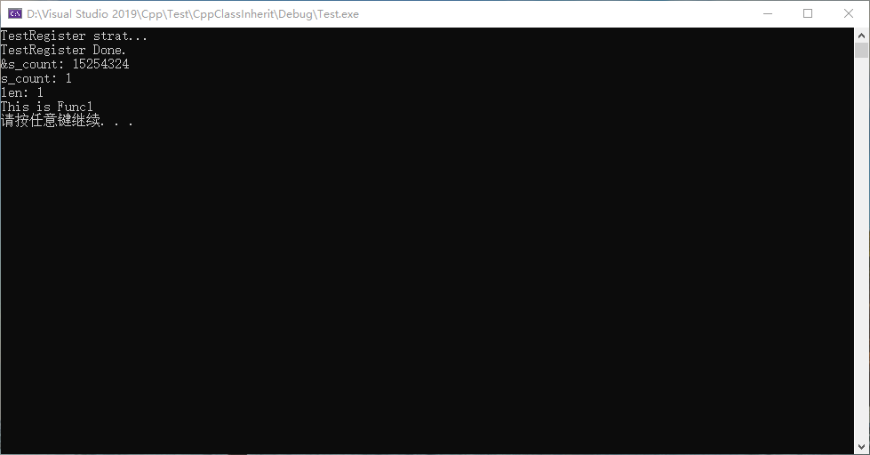
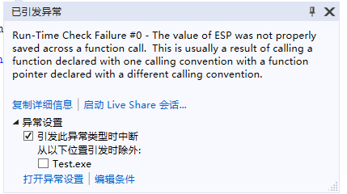

# 抽象类

- 抽象类中全是纯虚函数。

- 抽象类中的纯虚函数重要的是函数签名，函数名称不重要。
- 抽象类中的纯虚函数的排列顺序重要，是通过地址来定位函数，不是函数名称。

## 正常的抽象类虚函数实现

- 文件名称main.cpp

```C++
#include <iostream>

using std::cout;
using std::cerr;
using std::endl;

class TestBase
{
public:
	virtual void Func1() = 0;
};

int TestRegister(TestBase* testBase);

namespace TestCase
{
	class TestBase
	{
	public:
		virtual void Func1() = 0;
	};

	class TestCase1 : public TestBase
	{
		void Func1() override;
	};

	int TestCase1Fun()
	{
		TestBase* testCase1 = new TestCase1();
		TestRegister((::TestBase*)testCase1);
		return 0;
	}

	void TestCase1::Func1()
	{
		cout << "This is Func1" << endl;
	}
}

#define ARRAY_LENGTH(arr) (sizeof(arr) / sizeof((arr)[0]))

static TestBase* s_testObjectList[5] = { 0 };
static int s_count = 0;

int TestRegister(TestBase* testBase)
{
	cout << "TestRegister strat..." << endl;

	if (s_count >= ARRAY_LENGTH(s_testObjectList))
	{
		cerr << "Out of range!" << endl;
		return -EXIT_FAILURE;
	}

	s_testObjectList[s_count] = testBase;
	s_count++;

	cout << "TestRegister Done." << endl;
	cout << "&s_count: " << (long int)(&s_count) << endl;
	cout << "s_count: " << s_count << endl;

	return 0;
}

int32_t main()
{
	TestCase::TestCase1Fun();

	cout << "len: " << s_count << endl;

	if ((s_testObjectList != nullptr) && (s_count > 0))
	{
		for (int32_t i = 0; i < s_count; i++)
		{
			s_testObjectList[i]->Func1();
		}
	}

	system("pause");

	return 0;
}

```

### 运行结果



## 抽象类中纯虚函数名称不重要，重要的是函数签名

### 修改函数名称

- 修改文件main.cpp中虚函数的名称，见"Change"部分。

```c++
#include <iostream>
#include <stdint.h>

using std::cout;
using std::cerr;
using std::endl;

class TestBase
{
public:
	virtual void Func1() = 0;
};

int TestRegister(TestBase* testBase);

namespace TestCase
{
	class TestBase
	{
	public:
		// Change1
		virtual void Func1Mock() = 0;
	};

	class TestCase1 : public TestBase
	{
		void Func1Mock() override;
	};

	int TestCase1Fun()
	{
		TestBase* testCase1 = new TestCase1();
		TestRegister((::TestBase*)testCase1);
		return 0;
	}

	void TestCase1::Func1Mock()
	{
		// Change1
		cout << "This is Func1Mock" << endl;
	}
}

#define ARRAY_LENGTH(arr) (sizeof(arr) / sizeof((arr)[0]))

static TestBase* s_testObjectList[5] = { 0 };
static int s_count = 0;

int TestRegister(TestBase* testBase)
{
	cout << "TestRegister strat..." << endl;

	if (s_count >= ARRAY_LENGTH(s_testObjectList))
	{
		cerr << "Out of range!" << endl;
		return -EXIT_FAILURE;
	}

	s_testObjectList[s_count] = testBase;
	s_count++;

	cout << "TestRegister Done." << endl;
	cout << "&s_count: " << (long int)(&s_count) << endl;
	cout << "s_count: " << s_count << endl;

	return 0;
}

int32_t main()
{
	TestCase::TestCase1Fun();

	cout << "len: " << s_count << endl;

	if ((s_testObjectList != nullptr) && (s_count > 0))
	{
		for (int32_t i = 0; i < s_count; i++)
		{
			s_testObjectList[i]->Func1();
		}
	}

	system("pause");

	return 0;
}

```

#### 运行结果


### 修改函数签名

- 会导致运行时异常。



## 抽象类中函数的顺序

### 修改函数的顺序

- 修改文件main.cpp中虚函数的名称，见"Change2"部分。

```c++
#include <iostream>
#include <stdint.h>

using std::cout;
using std::cerr;
using std::endl;

class TestBase
{
public:
	virtual void Func1() = 0;
};

int TestRegister(TestBase* testBase);

namespace TestCase
{
	class TestBase
	{
	public:
		// Change2
		virtual void FuncNew() = 0;
		virtual void Func1() = 0;
	};

	class TestCase1 : public TestBase
	{
		// Change2
	    void FuncNew() override;
		void Func1() override;
	};

	int TestCase1Fun()
	{
		TestBase* testCase1 = new TestCase1();
		TestRegister((::TestBase*)testCase1);
		return 0;
	}

    // Change2
	void TestCase1::FuncNew()
	{
		cout << "This is FuncNew" << endl;
	}

	void TestCase1::Func1()
	{
		cout << "This is Func1" << endl;
	}
}

#define ARRAY_LENGTH(arr) (sizeof(arr) / sizeof((arr)[0]))

static TestBase* s_testObjectList[5] = { 0 };
static int s_count = 0;

int TestRegister(TestBase* testBase)
{
	cout << "TestRegister strat..." << endl;

	if (s_count >= ARRAY_LENGTH(s_testObjectList))
	{
		cerr << "Out of range!" << endl;
		return -EXIT_FAILURE;
	}

	s_testObjectList[s_count] = testBase;
	s_count++;

	cout << "TestRegister Done." << endl;
	cout << "&s_count: " << (long int)(&s_count) << endl;
	cout << "s_count: " << s_count << endl;

	return 0;
}

int32_t main()
{
	TestCase::TestCase1Fun();

	cout << "len: " << s_count << endl;

	if ((s_testObjectList != nullptr) && (s_count > 0))
	{
		for (int32_t i = 0; i < s_count; i++)
		{
			s_testObjectList[i]->Func1();
		}
	}

	system("pause");

	return 0;
}

```

#### 运行结果


## 总结

- 虚函数，重要的是函数签名和在 `vtable` 中的位置。
- 纯虚函数类似于函数指针。
- 抽象类最好写在头文件中，防止在多处被重新定义（虽然修改函数名称不影响函数的执行）。

