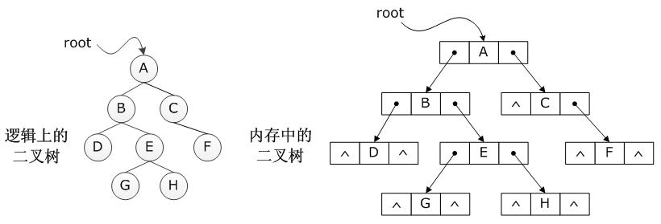
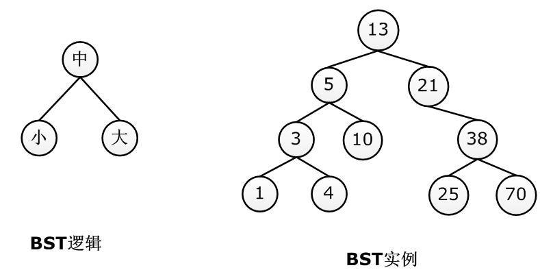

# 1 基本概念

BST就是二叉搜索树(Binary Search Tree)。


> 图1-1 二叉树的链式存储方式
>
> 


- BST规定：在任何子树中，根节点必须大于其左子树中任意的节点，且必须小于其右子树中任意的节点。BST必须满足“小-中-大”的逻辑次序


> 图1-2 BST示例
>
> 


# 2 树节点的设计

- 树节点包含三个要素：数据域、左孩子和右孩子

```c
typedef int datatype;

struct node // 二叉树节点
{
    datatype data; // 数据域
    struct node *lchild; // 左孩子指针
    struct node *rchild; // 右孩子指针
};
```

