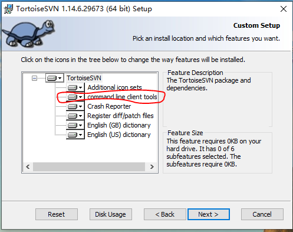

# 简介

- 手动设置应用的版本
- 自动获取源代码版本，并组合为完整的版本

完整的版本信息如：`x.x.x.y`，`y`为源代码的版本。

# windows

## svn

### 环境

windows下安装[TortoiseSVN](https://tortoisesvn.net/index.zh.html)，注意，一定要选择安装命令行工具，后需要使用其中的命令行工具。



### pri文件中设置版本信息

创建文件：`Version.pri`，与工程的`pro`文件在同一目录。

```qmake
# 软件主版本号
APP_VERSION = 1.0.0.

# 动态获取SVN版本号
SVN_VERSION = $$system(svnversion .)

# 检查 SVN 命令是否成功
SvnVersionResult = $$system(svnversion . > NUL 2>&1 && echo 0 || echo 1)

# 处理 SVN 版本号
contains(SvnVersionResult, "0") {
    contains(SVN_VERSION, "Unversioned directory") {
        SVN_VERSION = "0"
    } else {
        # 过滤掉多余的字符
        VERSION_LIST = $$split(SVN_VERSION, :)
        SVN_VERSION = $$take_last(VERSION_LIST)
        SVN_VERSION = $$replace(SVN_VERSION, M, )
        SVN_VERSION = $$replace(SVN_VERSION, S, )
        SVN_VERSION = $$replace(SVN_VERSION, P, )
    }
} else {
    # 如果失败，使用默认值
    SVN_VERSION = "0"
}

# 完整版本
VERSION = $$APP_VERSION$$SVN_VERSION

message("Version: $$VERSION")
```

:warning: 一定要保证生成的版本号为`1.0.0.123`这种，即数字何点的组合，如果格式不正确，编译时qmake或报错"syntax error"。

### pro文件中包含pri文件

```qmake
include(Version.pri)
```


