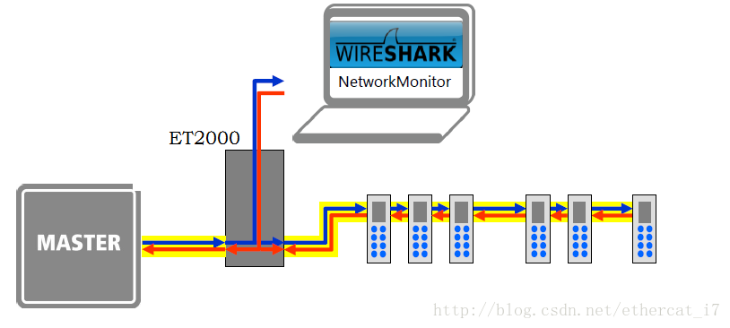
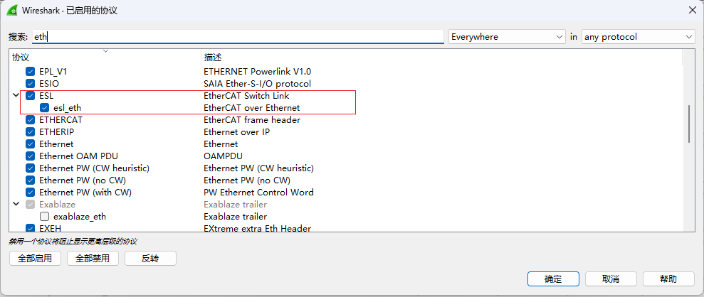
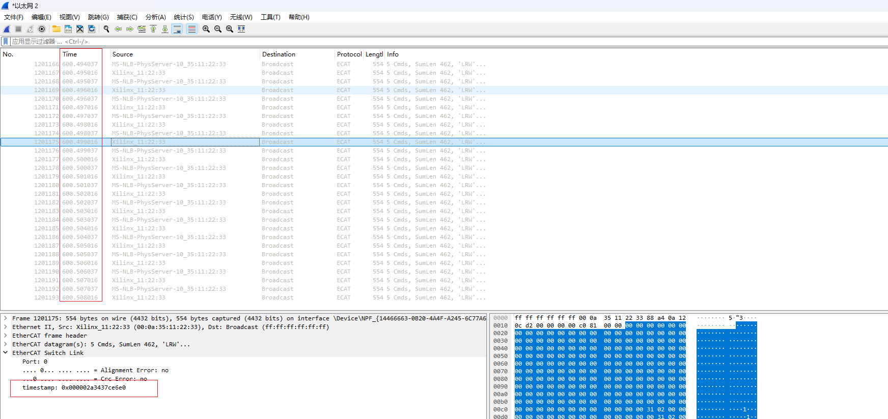
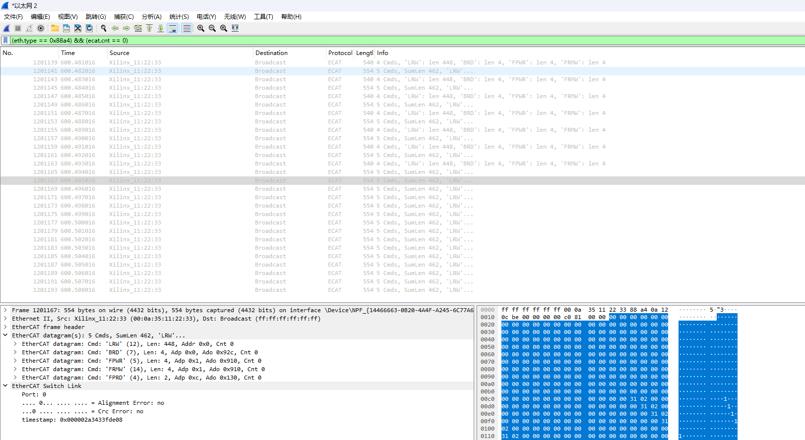

# 1. ET2000连接到EtherCAT总线中



# 2. Wireshark启用ESL协议

打开Wireshark -> 分析 ->启用的协议对话框，勾选esl_eth：



# 3. 抓取数据

抓取的数据如下，其中`EtherCAT Switch Link`下的`timestamp`是ET2000添加到数据包末尾的时间戳，单位为ns。而Time下的时间为运行Wireshark的Windows系统添加的时间戳。

分析时应使用`EtherCAT Switch Link`下的`timestamp`。



# 4. 筛选数据

分析主站发送数据的时间，即working counter 为0的数据，使用：

```
(eth.type == 0x88a4) && (ecat.cnt == 0)
```

过滤数据，并导出为另一个文件，例如导出到D:\test1-1.pcapng



# 5. 使用tshark导出时间戳

使用tshark命令将ET2000的时间戳导出为csv文件：

```cmd
tshark.exe -r "C:\Users\pxy\Desktop\test1-1.pcapng" -Y "(eth.type == 0x88a4) && (ecat.cnt == 0)" -n -T fields -e esl.timestamp > "C:\Users\pxy\Desktop\test1-1.csv"
```

需要使用过滤，否则数据中包含从站发回来的数据，导致统计不正确。

# 6. 绘制折线图（WPS）

1. 截取时间戳后九位，wps公式：`=RIGHT(SUBSTITUTE(A1:A12097,"0x",""),9)`。
2. 将16进制转换为10进制，wps公式：`=HEX2DEC(B1:B12097)`。
3. 复制一个新的列，新的列删除第一行。
4. 两列做减法，wps公式：`=D1:D12097-C1:C12097`
5. 将结果绘制为折线图。

