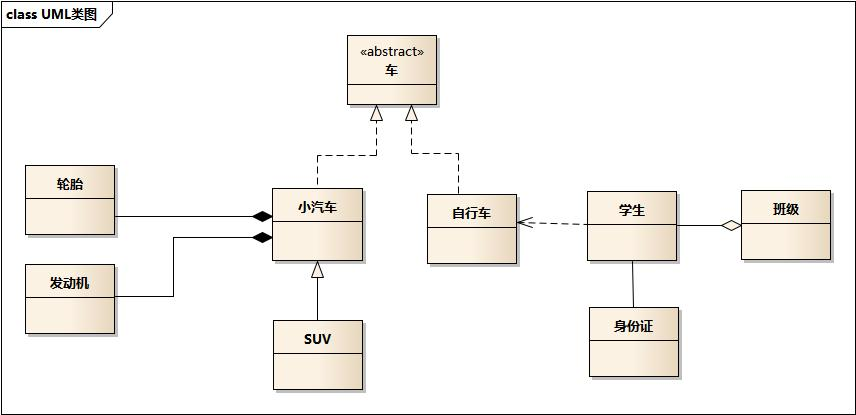

# Class Relationships

- 类和类之间的关系：泛化（Generalization），实现（Realization），关联（Association)，聚合（Aggregation），组合（Composition），依赖（Dependency）。
- 各种关系的强弱顺序： 泛化 = 实现 > 组合 > 聚合 > 关联 > 依赖。

## 例子

- 车的类图结构为\<\<abstract\>\>，表示车是一个抽象类；
- 它有两个继承类：小汽车和自行车；它们之间的关系为实现关系，使用带空心箭头的虚线表示；
- 小汽车为与SUV之间也是继承关系，它们之间的关系为泛化关系，使用带空心箭头的实线表示；
- 小汽车与发动机之间是组合关系，使用带实心箭头的实线表示；
- 学生与班级之间是聚合关系，使用带空心箭头的实线表示；
- 学生与身份证之间为关联关系，使用一根实线表示；
- 学生上学需要用到自行车，与自行车是一种依赖关系，使用带箭头的虚线表示；

## Association

关联

## Generalization

泛化

## Composition

组合

## Aggregation

聚合

## Associate Class

关联

## Realization

实现

## Template Binding

