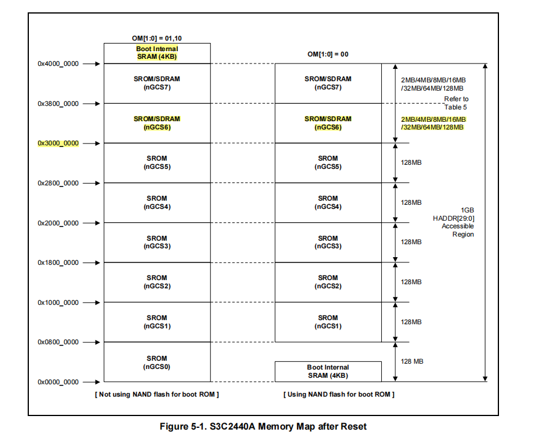

# 1. `NOR Flash` VS `NAND Flash`

| 对比项      | NOR Flash                                 | NAND Flash                                                   |
| ----------- | ----------------------------------------- | ------------------------------------------------------------ |
| 容量        | 1MB~32MB                                  | 16MB~512MB                                                   |
| *XIP*       | *是*                                      | *否*                                                         |
| *性能-擦除* | *非常慢（5s）*                            | *快（3ms）*                                                  |
| *性能-写*   | *慢*                                      | *快*                                                         |
| 性能-读     | 快                                        | 快                                                           |
| 可靠性      | 比较高，位反转的比例小于 NAND Flash 的10% | 比较低，位反转比较常见，必需有校验措施，比如 `TNR` 必须有坏块管理 |
| 可擦除次数  | 10,000 ~ 100,000                          | 100,000 ~ 1000,000                                           |
| 生命周期    | 低于 NAND Flash 的10%                     | 是 NOR Flash 的10倍以上                                      |
| *接口*      | *与 RAM 接口相同*                         | *I/O 接口*                                                   |
| 访问方法    | 随机访问                                  | 顺序访问                                                     |
| 易用性      | 容易                                      | 复杂                                                         |
| *主要用途*  | *常用于保存代码和关键数据*                | *用于保存数据*                                               |
| 价格        | 高                                        | 低                                                           |


> [!note]
>
> 1. NOR Flash 支持 `XIP`，即代码可以直接在 NOR Flash 上执行。
> 2. NOR Flash写之前也需要进行擦除。


# 2. NAND Flash 与 NOR Flash 启动的区别

> [!important]
>
> NOR Flash 虽然可以像内存一样进行读操作，但是不能像内存一样进行写操作，所以从 NOR Flash 启动时，一般先在代码开始的部分使用汇编指令初始化外接的内存器件，然后将代码复制到外存中，最后跳转到外村中继续执行。

## 2.1. 启动时的内存地址



> [!important]
>
> 不管使用 NOR Flash 启动还是 NAND Flash 启动，启动地址都是0x0000_0000。

如上图所示，在只使用内部SRAM的情况下，内存地址对比如下：

| 内存信息   | NOR Flash     | NAND Flash    |
| ---------- | ------------- | ------------- |
| *内存地址* | *0x4000_0000* | *0x0000_0000* |
| 大小       | 4KB           | 4KB           |

> [!important]
>
> 内存的起始地址不同，如果程序中需要使用栈，从 NOR Flash 与 NAND Flash 情况有所不同：
>
> - NOR Flash 是直接在 Flash 中启动执行。
> - NAND Flash 是将程序复制到内部 SRAM 中执行。

## 2.2. 启动对比

`leds` 代码功能是使3个 LED 闪烁，`leds` 程序代码如下：

`crt0.S`:

```assembly
.text
.global _start
_start:
    LDR R0, =0x53000000 @ WTCON: Watchdog timer control register.
    MOV R1, #0x00000000 @ 0: Disable the reset function of the watchdog timer.
    STR R1, [R0]

    ldr sp, =1024 * 4   @ 设置栈指针，注意：不能大于4k, 因为现在可用的内存只有4K．
    bl main
HALT_LOOP:
    b HALT_LOOP

```

> [!tip]
>
> crt0: **C** **R**un **T**ime Zero.

`leds.c`:

```c
// GPFCON: 2b'00=input, 2b'01=output, 2b'10=eint[4], 2b'11=reserved.
#define GPFCON      (*(volatile unsigned long *)0x56000050)
// GPFDAT: 每一位控制一个IO．
#define GPFDAT      (*(volatile unsigned long *)0x56000054)

#define LED1_PIN 4
#define LED2_PIN 5
#define LED4_PIN 6

/*
 * IO口设置为输出: GPF4, GPF5, GPF6．
 */

#define	GPF4_OUT	(1 << (LED1_PIN * 2))
#define	GPF5_OUT	(1 << (LED2_PIN * 2))
#define	GPF6_OUT	(1 << (LED4_PIN * 2))

#define BIT(n)              (1U << (n))
#define SET_BIT(var, bit)   ((var) |= BIT(bit))
#define CLEAR_BIT(var, bit) ((var) &= ~BIT(bit))

#define LED_ON(cur_value, pin)      CLEAR_BIT(cur_value, pin)
#define LED_OFF(cur_value, pin)		SET_BIT(cur_value, pin)

void delay(volatile unsigned long count)
{
    for (; count > 0; count--);
}

int main(void)
{
    unsigned long cur_value = 0;

    GPFCON = GPF4_OUT | GPF5_OUT | GPF6_OUT;

    while (1)
    {
        cur_value = GPFDAT;
        cur_value = LED_ON(cur_value, LED1_PIN);
        cur_value = LED_ON(cur_value, LED2_PIN);
        cur_value = LED_ON(cur_value, LED4_PIN);
        GPFDAT = cur_value;

        delay(30000);

        cur_value = GPFDAT;
        cur_value = LED_OFF(cur_value, LED1_PIN);
        cur_value = LED_OFF(cur_value, LED2_PIN);
        cur_value = LED_OFF(cur_value, LED4_PIN);
        GPFDAT = cur_value;

        delay(30000);
    }

    return 0;
}

```

`leds.lds`:

```
SECTIONS {
    . = 0x00000000;
    .text : {
        *(.text)
    }
    .rodata ALIGN(4) : {
        *(.rodata)
    }
    .data ALIGN(4) : {
        *(.data)
    }
    .bss ALIGN(4) : {
        *(.bss)
        *(COMMON)
    }
}
```


### 2.2.1. NAND Flash 启动

LED 正常闪烁。

NAND Flash 启动，程序被加载到 SoC 内部的 SRAM 运行。设置栈指针时，此时 SoC 内部 SRAM 的地址为0x0000_0000，大小为4096字节。

`crt0.S` 设置栈指针：

```assembly
ldr sp, =1024 * 4
```

### 2.2.2. NOR Flash 启动

LED 无法闪烁，并且 LED 不亮。

NAND Flash 启动，程序从 NOR Flash 运行。设置栈指针时，此时 SoC 内部 SRAM 的地址为0x4000_0000，大小为4096字节。

`crt0.S` 设置栈指针：

```assembly
ldr sp, =1024 * 4
```

这样会导致栈处于 NOR Flash，所以栈中的未初始化的数据此时应为 `0xFF`。还会导致栈的数据无法修改，因为 NOR Flash写入之前需要进行擦除。

为控制 LED 的 SoC 寄存器写入1，LED 熄灭。

#### 2.2.2.1 使用整数字面量让 LED 闪烁

- 由于不能使用堆栈，所示重新实现了新的延时函数 `delay30000_asm`，固定延时`30000`。

- 对寄存赋值，直接使用整数字面量，没有使用栈上的变量。

代码如下所示：

```diff
--- leds.c-bkup 2025-06-15 11:20:11.493745337 +0800
+++ leds.c      2025-06-15 12:11:37.161084407 +0800
@@ -27,6 +27,16 @@
     for (; count > 0; count--);
 }

+__attribute__((naked)) void delay30000_asm(void) {
+    // n: 延时循环次数
+    asm volatile (
+        "ldr r0, =30000 \n\t"
+        "1: subs r0, r0, #1 \n\t" // n = n - 1, 并更新标志位
+        "bne 1b \n\t"          // 如果n不为0，跳回1
+        "bx lr \n\t"
+    );
+}
+
 int main(void)
 {
     unsigned long cur_value = 0;
@@ -35,21 +45,25 @@

     while (1)
     {
-        cur_value = GPFDAT;
-        cur_value = LED_ON(cur_value, LED1_PIN);
-        cur_value = LED_ON(cur_value, LED2_PIN);
-        cur_value = LED_ON(cur_value, LED4_PIN);
-        GPFDAT = cur_value;
-
-        delay(30000);
-
-        cur_value = GPFDAT;
-        cur_value = LED_OFF(cur_value, LED1_PIN);
-        cur_value = LED_OFF(cur_value, LED2_PIN);
-        cur_value = LED_OFF(cur_value, LED4_PIN);
-        GPFDAT = cur_value;
+        // cur_value = GPFDAT;
+        // cur_value = LED_ON(cur_value, LED1_PIN);
+        // cur_value = LED_ON(cur_value, LED2_PIN);
+        // cur_value = LED_ON(cur_value, LED4_PIN);
+        // GPFDAT = cur_value;
+        GPFDAT = ~((1 << LED1_PIN) | (1 << LED2_PIN) | (1 << LED4_PIN));
+
+        // delay(30000);
+        delay30000_asm();
+
+        // cur_value = GPFDAT;
+        // cur_value = LED_OFF(cur_value, LED1_PIN);
+        // cur_value = LED_OFF(cur_value, LED2_PIN);
+        // cur_value = LED_OFF(cur_value, LED4_PIN);
+        // GPFDAT = cur_value;
+        GPFDAT = ((1 << LED1_PIN) | (1 << LED2_PIN) | (1 << LED4_PIN));

-        delay(30000);
+        // delay(30000);
+        delay30000_asm();
     }

     return 0;
```

#### 2.2.2.2 设置栈地址到 SoC 内部 SRAM 使 LED 闪烁

```assembly
--- crt0.S-bkup 2025-06-18 00:09:42.831296105 +0800
+++ crt0.S      2025-06-18 00:10:08.542059355 +0800
@@ -5,7 +5,10 @@
     MOV R1, #0x00000000 @ 0: Disable the reset function of the watchdog timer.
     STR R1, [R0]
 
-    ldr sp, =1024 * 4   @ 设置栈指针，注意：不能大于4k, 因为现在可用的内存只有4K．
+    LDR R2, =0x40000000
+    ADD R2, R2, #0x1000 @ 0x40000000 - 0x1000 = 0x3FFF0000
+    MOV SP, R2
+    @ ldr sp, =1024 * 4   @ 设置栈指针，注意：不能大于4k, 因为现在可用的内存只有4K．
     bl main
 HALT_LOOP:
     b HALT_LOOP
```
