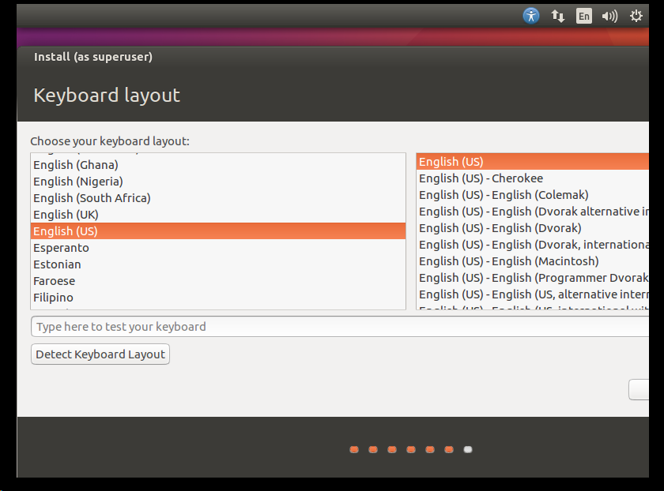

# 简介

## 版本

`xilinx-v14.5`

## 软件

- VMWare：`VMware-workstation-full-16.2.4-20089737`
- Ubuntu：`Ubuntu 16.04`
- Toolchains：`xilinx-2011.09-50-arm-xilinx-linux-gnueabi.bin`或则`Xilinx SDK 2013.1`。

# 安装VMWare

运行`VMware-workstation-full-16.2.4-20089737`，默认配置下一步即可。

注意：

- 选择安装目录。
- 增强型键盘驱动程序，最好勾选上。


# 安装Ubuntu

## 使用VMWare创建虚拟机

1. 创建虚拟机：


2. 选择版本，与VMWare的版本一致即可。后续可在不同PC的同版本的VMWare上导入使用如。


3. 选择后续再安装操作系统。


4. 选择操作系统类型：Linux。


5. 设置虚拟机的安装位置


6. 分配CPU给虚拟机


7. 分配内存给虚拟机：4GiB


8. 设置虚拟机网络类型：NAT


9. 设置I/O控制器类型：使用推荐设置


10. 选择磁盘类型：使用推荐设置


11. 创建新虚拟磁盘


12. 设置虚拟机磁盘容量：100GiB


13. 指定磁盘文件：默认即可


## 安装Ubuntu

1. 选择系统镜像


2. 设置键盘，否则可能导致无法复制内容到host电脑。


3. 点击“开启此虚拟机”，开始安装：


4. 安装ubuntu，选择"Install Ubuntu"


5. 不设置联网下载


6. 擦除虚拟机磁盘


7. 选择位置:Shanghai


8. 选择键盘：US



9. 设置账户密码


10. 安装完成，取消如下设置，否则可能导致系统无法启动


11. 启动虚拟机，打开终端，输入密码，关闭终端。


## 安装vm-tools


点击安装 Tools，弹出如下窗口：


打开终端，安装过程中，确认目录的地方，直接`Enter`键即可：

```shell
linux@linux-virtual-machine:/media/linux/VMware Tools$ cp VMwareTools-10.3.23-16594550.tar.gz ~/Downloads/
linux@linux-virtual-machine:/media/linux/VMware Tools$ cd ~/Downloads/
linux@linux-virtual-machine:~/Downloads$ ls
VMwareTools-10.3.23-16594550.tar.gz
linux@linux-virtual-machine:~/Downloads$ tar  xvf VMwareTools-10.3.23-16594550.tar.gz 
linux@linux-virtual-machine:~/Downloads$ cd vmware-tools-distrib/
linux@linux-virtual-machine:~/Downloads/vmware-tools-distrib$ ls
bin  caf  doc  etc  FILES  INSTALL  installer  lib  vgauth  vmware-install.pl
linux@linux-virtual-machine:~/Downloads/vmware-tools-distrib$ sudo ./vmware-install.pl 
[sudo] password for linux: 
open-vm-tools packages are available from the OS vendor and VMware recommends 
using open-vm-tools packages. See http://kb.vmware.com/kb/2073803 for more 
information.
Do you still want to proceed with this installation? [no] yes

INPUT: [yes]

Creating a new VMware Tools installer database using the tar4 format.

Installing VMware Tools.

In which directory do you want to install the binary files? 
[/usr/bin] 

INPUT: [/usr/bin]  default

What is the directory that contains the init directories (rc0.d/ to rc6.d/)? 
[/etc] 

INPUT: [/etc]  default

What is the directory that contains the init scripts? 
[/etc/init.d] 

INPUT: [/etc/init.d]  default

In which directory do you want to install the daemon files? 
[/usr/sbin] 

INPUT: [/usr/sbin]  default

In which directory do you want to install the library files? 
[/usr/lib/vmware-tools] 

INPUT: [/usr/lib/vmware-tools]  default

The path "/usr/lib/vmware-tools" does not exist currently. This program is 
going to create it, including needed parent directories. Is this what you want?
[yes] 

INPUT: [yes]  default

In which directory do you want to install the common agent library files? 
[/usr/lib] 

INPUT: [/usr/lib]  default

In which directory do you want to install the common agent transient files? 
[/var/lib] 

INPUT: [/var/lib]  default

In which directory do you want to install the documentation files? 
[/usr/share/doc/vmware-tools] 

INPUT: [/usr/share/doc/vmware-tools]  default

The path "/usr/share/doc/vmware-tools" does not exist currently. This program 
is going to create it, including needed parent directories. Is this what you 
want? [yes] 

INPUT: [yes]  default

The installation of VMware Tools 10.3.23 build-16594550 for Linux completed 
successfully. You can decide to remove this software from your system at any 
time by invoking the following command: "/usr/bin/vmware-uninstall-tools.pl".

Before running VMware Tools for the first time, you need to configure it by 
invoking the following command: "/usr/bin/vmware-config-tools.pl". Do you want 
this program to invoke the command for you now? [yes] 

INPUT: [yes]  default

Initializing...


Making sure services for VMware Tools are stopped.

Stopping VMware Tools services in the virtual machine:
   Guest operating system daemon:                                      done
   VMware User Agent (vmware-user):                                    done
   Unmounting HGFS shares:                                             done
   Guest filesystem driver:                                            done


The module vmci has already been installed on this system by another installer 
or package and will not be modified by this installer.

The module vsock has already been installed on this system by another installer
or package and will not be modified by this installer.

The module vmxnet3 has already been installed on this system by another 
installer or package and will not be modified by this installer.

The module pvscsi has already been installed on this system by another 
installer or package and will not be modified by this installer.

The module vmmemctl has already been installed on this system by another 
installer or package and will not be modified by this installer.

The VMware Host-Guest Filesystem allows for shared folders between the host OS 
and the guest OS in a Fusion or Workstation virtual environment.  Do you wish 
to enable this feature? [yes] yes

INPUT: [yes]

The vmxnet driver is no longer supported on kernels 3.3 and greater. Please 
upgrade to a newer virtual NIC. (e.g., vmxnet3 or e1000e)

The vmblock enables dragging or copying files between host and guest in a 
Fusion or Workstation virtual environment.  Do you wish to enable this feature?
[yes] yes

INPUT: [yes]


Skipping configuring automatic kernel modules as no drivers were installed by 
this installer.


Disabling timer-based audio scheduling in pulseaudio.

Do you want to enable Guest Authentication (vgauth)? Enabling vgauth is needed 
if you want to enable Common Agent (caf). [yes] yes

INPUT: [yes]

Do you want to enable Common Agent (caf)? [no] no

INPUT: [no]


Detected X server version 1.19.3


Distribution provided drivers for Xorg X server are used.

Skipping X configuration because X drivers are not included.


Skipping rebuilding initrd boot image for kernel as no drivers to be included 
in boot image were installed by this installer.

Generating the key and certificate files.
Successfully generated the key and certificate files.
The configuration of VMware Tools 10.3.23 build-16594550 for Linux for this 
running kernel completed successfully.

You must restart your X session before any mouse or graphics changes take 
effect.

To enable advanced X features (e.g., guest resolution fit, drag and drop, and 
file and text copy/paste), you will need to do one (or more) of the following:
1. Manually start /usr/bin/vmware-user
2. Log out and log back into your desktop session
3. Restart your X session.

Enjoy,

--the VMware team

```

## VMWare设置共享目录

注意：关闭虚拟机才能设置


添加共享目录：


# 配置Xilinx开发环境

复制`xilinx-2011.09-50-arm-xilinx-linux-gnueabi.bin`到共享目录`E:\VM\Share\Ubuntu_16_64_Xilinx`。

## 修改shell为bash

```shell
linux@linux-virtual-machine:~/Downloads$ sudo dpkg-reconfigure -plow dash
```

选择`no`

检查是否设置成功：

```shell
linux@linux-virtual-machine:~/Downloads$ ls -l /bin/sh
lrwxrwxrwx 1 root root 4 1月   2 15:18 /bin/sh -> bash
```

## 安装工具链
```shell
linux@linux-virtual-machine:~/Downloads$ ./xilinx-2011.09-50-arm-xilinx-linux-gnueabi.bin 
```

```shell
Checking for required programs: awk grep sed bzip2 gunzip
Preparing to install...
Extracting the JRE from the installer archive...
Unpacking the JRE...
Extracting the installation resources from the installer archive...
Configuring the installer for this system's environment...
strings: '/lib/libc.so.6': No such file

Launching installer...


Graphical installers are not supported by the VM. The console mode will be used instead...

Preparing CONSOLE Mode Installation...

===============================================================================
Sourcery CodeBench Lite for Xilinx GNU/Linux     (created with InstallAnywhere)
-------------------------------------------------------------------------------


===============================================================================
Introduction
------------

InstallAnywhere will guide you through the installation of Sourcery CodeBench 
Lite for Xilinx GNU/Linux.

It is strongly recommended that you quit all programs before continuing with 
this installation.

Respond to each prompt to proceed to the next step in the installation.  If you
want to change something on a previous step, type 'back'.

You may cancel this installation at any time by typing 'quit'.

PRESS <ENTER> TO CONTINUE: 


===============================================================================
License Agreement
-----------------

Please read the Software License Agreement below, by scrolling if necessary, 
and accept by typing "Y" at the prompt "DO YOU ACCEPT THE TERMS OF THIS LICENSE
AGREEMENT? (Y/N):".

MENTOR GRAPHICS IS WILLING TO LICENSE THE SOFTWARE ONLY UPON THE CONDITION THAT
YOU ACCEPT ALL OF THE TERMS CONTAINED IN THIS SOFTWARE LICENSE AGREEMENT. 
PLEASE READ THE TERMS CAREFULLY.  BY CLICKING ON "I accept the terms of the 
License Agreement", YOU WILL INDICATE YOUR AGREEMENT WITH THEM. IF YOU ARE 
ENTERING INTO THIS AGREEMENT ON BEHALF OF A COMPANY OR OTHER LEGAL ENTITY, YOUR
ACCEPTANCE REPRESENTS THAT YOU HAVE THE AUTHORITY TO BIND SUCH ENTITY TO THESE 
TERMS, IN WHICH CASE "YOU" OR "YOUR" SHALL REFER TO YOUR ENTITY. IF YOU DO NOT 
AGREE WITH THESE TERMS, OR IF YOU DO NOT HAVE THE AUTHORITY TO BIND YOUR 
ENTITY, THEN MENTOR GRAPHICS IS UNWILLING TO LICENSE THE SOFTWARE.


Sourcery CodeBench Software License Agreement

-  Parties.

The parties to this Agreement are you, the licensee (You or Licensee) and 
Mentor Graphics. If You are not acting on behalf of Yourself as an individual, 
then You means Your company or organization.

-  The Software

The Software licensed under this Agreement consists of computer programs and 
documentation referred to as Sourcery CodeBench Lite Edition (the Software).

PRESS <ENTER> TO CONTINUE: 


-  Definitions.
-  Mentor Graphics Proprietary Components.

The components of the Software that are owned and/or licensed by Mentor 
Graphics and are not subject to a free software or open source license, such as
the GNU Public License. The Mentor Graphics Proprietary Components of the 
Software include, without limitation, the Sourcery CodeBench Installer, any 
Sourcery CodeBench Eclipse plug-ins, the CodeSourcery C Library (CSLIBC), and 
any Sourcery CodeBench Debug Sprite. For a complete list, refer to the Getting 
Started Guide included with the distribution.

-  Open Source Software Components.

The components of the Software that are subject to a free software or open 
source license, such as the GNU Public License.

-  Proprietary Rights.

All rights in and to copyrights, rights to register copyrights, trade secrets, 
inventions, patents, patent rights, trademarks, trademark rights, confidential 
and proprietary information protected under contract or otherwise under law, 

PRESS <ENTER> TO CONTINUE: 

and other similar rights or interests in intellectual or industrial property.

-  Redistributable Components.

The Mentor Graphics Proprietary Components that are intended to be incorporated
or linked into Licensee object code developed with the Software. The 
Redistributable Components of the Software include, without limitation, CSLIBC 
and the CodeSourcery Common Startup Code Sequence (CS3). For a complete list, 
refer to the Getting Started Guide included with the distribution.

-  License Grant to Proprietary Components of the Software.

You are granted a non-exclusive, royalty-free license (a) to install and use 
the Mentor Graphics Proprietary Components of the Software, (b) to transmit the
Mentor Graphics Proprietary Components over an internal computer network, (c) 
to copy the Mentor Graphics Proprietary Components for Your internal use only, 
and (d) to distribute the Redistributable Component(s) in binary form only and 
only as part of Licensee object code developed with the Software that provides 
substantially different functionality than the Redistributable Component(s).

-  Restrictions.


PRESS <ENTER> TO CONTINUE: 

You may not: (i) copy or permit others to use the Mentor Graphics Proprietary 
Components of the Software, except as expressly provided above; (ii) distribute
the Mentor Graphics Proprietary Components of the Software to any third party, 
except as expressly provided above; or (iii) reverse engineer, decompile, or 
disassemble the Mentor Graphics Proprietary Components of the Software, except 
to the extent this restriction is expressly prohibited by applicable law.

-  ARM Keil ULINK2 Drivers.

Sourcery CodeBench may include ULINK2 drivers from ARM,�Ltd. If these drivers 
are included, the following additional terms and conditions apply:
-

You may use the ULINK2 drivers only in conjunction with a compatible ARM Keil 
ULINK2 hardware unit manufactured by or under license from ARM and purchased 
from Mentor Graphics, ARM, or a distributor authorized by ARM.

-

You may use the ULINK2 drivers only to connect to the GNU Debugger included in 
Sourcery CodeBench.


PRESS <ENTER> TO CONTINUE: 

-

The ULINK2 drivers are not supported by ARM, Ltd.; You should contact Mentor 
Graphics for any support regarding the ULINK2 drivers.

-

You may not redistribute or transfer the ULINK2 drivers.

-

You may not translate, adapt, arrange or otherwise alter the object code of the
ULINK2 drivers (including without limitation copying, adapting or reverse 
compiling the object code of the ULINK2 drivers for the purpose of error 
correction) except as allowed by applicable law.

-

You may not remove or obstruct any notice or marker incorporated into the 
ULINK2 drivers to protect ARM's or third parties' intellectual property or 
Proprietary Rights.


PRESS <ENTER> TO CONTINUE: 

-

The ULINK2 drivers are licensed, not sold; all right, title and interest 
therein is reserved to Mentor Graphics or its licensors, and You acquire no 
right, title or interest therein.

-  SEGGER J-Link Devices.

Sourcery CodeBench Lite includes proprietary software from  SEGGER 
Microcontroller GmbH & Co.KG that allows the use of  SEGGER J-Link debug 
devices with the Sourcery CodeBench Lite Debug Sprite.  You may use software 
from SEGGER only under the SEGGER J-Link software   terms of use and   license 
agreement.

-  Sourcery CodeBench Debug Sprite with ARM SWD.

The Sourcery CodeBench Debug Sprite for ARM and Stellaris processors includes 
software for ARM SWD support from ARM, Ltd. You may use the ARM SWD software 
only in conjunction with a Cortex-M1 or Cortex-M3 microprocessor manufactured 
under license from ARM.

-   Sourcery CodeBench Debug Sprite for P&E Devices.

PRESS <ENTER> TO CONTINUE: 


You may use the Sourcery CodeBench Debug Sprite for P&E only in conjunction 
with ColdFire microprocessors and with debugging devices produced by P&E 
Microcomputer Systems.

Sourcery CodeBench Debug Sprite for P&E Devices.

This software application may include P&E NGS Drivers version 120210 
third-party software, which is distributed on an "AS IS" basis, WITHOUT 
WARRANTY OF ANY KIND, either express or implied. P&E NGS Drivers version 120210
may be subject to the following copyrights: � 1999-2003, Lukas Gebauer All 
rights reserved. Redistribution and use in source and binary forms, with or 
without modification, are permitted provided that the following conditions are 
met:
    - Redistributions of source code must retain the above copyright notice, 
this list of conditions and the following disclaimer.
    - Redistributions in binary form must reproduce the above copyright notice,
this list of conditions and the following disclaimer in the documentation 
and/or other materials provided with the distribution.
    - Neither the name of Lukas Gebauer nor the names of its contributors may 
be used to endorse or promote products derived from this software without 
specific prior written permission.

PRESS <ENTER> TO CONTINUE: 

    - THIS SOFTWARE IS PROVIDED BY THE COPYRIGHT HOLDERS AND CONTRIBUTORS "AS 
IS" AND ANY EXPRESS OR IMPLIED WARRANTIES, INCLUDING, BUT NOT LIMITED TO, THE 
IMPLIED WARRANTIES OF MERCHANTABILITY AND FITNESS FOR A PARTICULAR PURPOSE ARE 
DISCLAIMED. IN NO EVENT SHALL THE REGENTS OR CONTRIBUTORS BE LIABLE FOR ANY 
DIRECT, INDIRECT, INCIDENTAL, SPECIAL, EXEMPLARY, OR CONSEQUENTIAL DAMAGES 
(INCLUDING, BUT NOT LIMITED TO, PROCUREMENT OF SUBSTITUTE GOODS OR SERVICES; 
LOSS OF USE, DATA, OR PROFITS; OR BUSINESS INTERRUPTION) HOWEVER CAUSED AND ON 
ANY THEORY OF LIABILITY, WHETHER IN CONTRACT, STRICT LIABILITY, OR TORT 
(INCLUDING NEGLIGENCE OR OTHERWISE) ARISING IN ANY WAY OUT OF THE USE OF THIS 
SOFTWARE, EVEN IF ADVISED OF THE POSSIBILITY OF SUCH DAMAGE.

        -  Free Software or Open Source License to Certain Components of the 
Software

This Agreement does not limit Your rights under, or grant You rights that 
supersede, the license terms of any Open Source Software Component delivered to
You by Mentor Graphics. Sourcery CodeBench includes components provided under 
various different licenses. The Getting Started Guide provides an overview of 
which license applies to different components, and, for components subject to 
the Eclipse Public License, contains information on how to obtain the source 
code. Definitive licensing information for each free software or open source 
component is available in the relevant source file.

PRESS <ENTER> TO CONTINUE: 


-  Mentor Graphics Trademarks.

Notwithstanding any provision in a free software or open source license 
agreement applicable to a component of the Software that permits You to 
distribute such component to a third party in source or binary form, You may 
not use any Mentor Graphics trademark, whether registered or unregistered, 
including without limitation, CodeSourcery, Sourcery CodeBench, the 
CodeSourcery crystal ball logo, or the Sourcery CodeBench splash screen, or any
confusingly similar mark, in connection with such distribution, and You may not
recompile the Open Source Software Components with the --with-pkgversion or 
--with-bugurl configuration options that embed Mentor Graphics trademarks in 
the resulting binary.

-  Term and Termination.

This Agreement shall remain in effect unless terminated pursuant to this 
provision. Mentor Graphics may terminate this Agreement upon seven (7) days 
written notice of a material breach of this Agreement if such breach is not 
cured; provided that the unauthorized use, copying, or distribution of the 
Mentor Graphics Proprietary Components of the Software will be deemed a 
material breach that cannot be cured.

PRESS <ENTER> TO CONTINUE: 


-  Transfers.

You may not transfer any rights under this Agreement without the prior written 
consent of Mentor Graphics, which consent shall not be unreasonably withheld. A
condition to any transfer or assignment shall be that the recipient agrees to 
the terms of this Agreement. Any attempted transfer or assignment in violation 
of this provision shall be null and void.

-  Ownership.

Mentor Graphics owns and/or has licensed the Mentor Graphics Proprietary 
Components of the Software and all intellectual property rights embodied 
therein, including copyrights and valuable trade secrets embodied in its design
and coding methodology. The Mentor Graphics Proprietary Components of the 
Software are protected by United States copyright laws and international treaty
provisions. Mentor Graphics also owns all rights, title and interest in and 
with respect to its trade names, domain names, trade dress, logos, trademarks, 
service marks, and other similar rights or interests in intellectual property. 
This Agreement provides You only a limited use license, and no ownership of any
intellectual property.


PRESS <ENTER> TO CONTINUE: 

-  Warranty Disclaimer; Limitation of Liability.

MENTOR GRAPHICS AND ITS LICENSORS PROVIDE THE SOFTWARE AS-IS AND PROVIDED WITH 
ALL FAULTS. MENTOR GRAPHICS DOES NOT MAKE ANY WARRANTY OF ANY KIND, EXPRESS OR 
IMPLIED. MENTOR GRAPHICS SPECIFICALLY DISCLAIMS THE IMPLIED WARRANTIES OF 
TITLE, NON-INFRINGEMENT, MERCHANTABILITY, FITNESS FOR A PARTICULAR PURPOSE, 
SYSTEM INTEGRATION, AND DATA ACCURACY. THERE IS NO WARRANTY OR GUARANTEE THAT 
THE OPERATION OF THE SOFTWARE WILL BE UNINTERRUPTED, ERROR-FREE, OR VIRUS-FREE,
OR THAT THE SOFTWARE WILL MEET ANY PARTICULAR CRITERIA OF PERFORMANCE, QUALITY,
ACCURACY, PURPOSE, OR NEED. YOU ASSUME THE ENTIRE RISK OF SELECTION, 
INSTALLATION, AND USE OF THE SOFTWARE. THIS DISCLAIMER OF WARRANTY CONSTITUTES 
AN ESSENTIAL PART OF THIS AGREEMENT. NO USE OF THE SOFTWARE IS AUTHORIZED 
HEREUNDER EXCEPT UNDER THIS DISCLAIMER.

-  Local Law.

If implied warranties may not be disclaimed under applicable law, then ANY 
IMPLIED WARRANTIES ARE LIMITED IN DURATION TO THE PERIOD REQUIRED BY APPLICABLE
LAW.

-  Limitation of Liability.


PRESS <ENTER> TO CONTINUE: 

INDEPENDENT OF THE FORGOING PROVISIONS, IN NO EVENT AND UNDER NO LEGAL THEORY, 
INCLUDING WITHOUT LIMITATION, TORT, CONTRACT, OR STRICT PRODUCTS LIABILITY, 
SHALL MENTOR GRAPHICS BE LIABLE TO YOU OR ANY OTHER PERSON FOR ANY INDIRECT, 
SPECIAL, INCIDENTAL, OR CONSEQUENTIAL DAMAGES OF ANY KIND, INCLUDING WITHOUT 
LIMITATION, DAMAGES FOR LOSS OF GOODWILL, WORK STOPPAGE, COMPUTER MALFUNCTION, 
OR ANY OTHER KIND OF COMMERCIAL DAMAGE, EVEN IF MENTOR GRAPHICS HAS BEEN 
ADVISED OF THE POSSIBILITY OF SUCH DAMAGES. THIS LIMITATION SHALL NOT APPLY TO 
LIABILITY FOR DEATH OR PERSONAL INJURY TO THE EXTENT PROHIBITED BY APPLICABLE 
LAW. IN NO EVENT SHALL MENTOR GRAPHICS' LIABILITY FOR ACTUAL DAMAGES FOR ANY 
CAUSE WHATSOEVER, AND REGARDLESS OF THE FORM OF ACTION, EXCEED THE AMOUNT PAID 
BY YOU IN FEES UNDER THIS AGREEMENT DURING THE PREVIOUS ONE YEAR PERIOD.

-  Export Controls.

You agree to comply with all export laws and restrictions and regulations of 
the United States or foreign agencies or authorities, and not to export or 
re-export the Software or any direct product thereof in violation of any such 
restrictions, laws or regulations, or without all necessary approvals. As 
applicable, each party shall obtain and bear all expenses relating to any 
necessary licenses and/or exemptions with respect to its own export of the 
Software from the U.S. Neither the Software nor the underlying information or 
technology may be electronically transmitted or otherwise exported or 

PRESS <ENTER> TO CONTINUE: 

re-exported (i) into Cuba, Iran, Iraq, Libya, North Korea, Sudan, Syria or any 
other country subject to U.S. trade sanctions covering the Software, to 
individuals or entities controlled by such countries, or to nationals or 
residents of such countries other than nationals who are lawfully admitted 
permanent residents of countries not subject to such sanctions; or (ii) to 
anyone on the U.S. Treasury Department's list of Specially Designated Nationals
and Blocked Persons or the U.S. Commerce Department's Table of Denial Orders. 
By downloading or using the Software, Licensee agrees to the foregoing and 
represents and warrants that it complies with these conditions.

-  U.S. Government End-Users.

The Software is a commercial item, as that term is defined in 48 C.F.R. 2.101 
(Oct. 1995), consisting of commercial computer software and commercial computer
software documentation, as such terms are used in 48 C.F.R. 12.212 (Sept. 
1995). Consistent with 48 C.F.R. 12.212 and 48 C.F.R. 227.7202-1 through 
227.7202-4 (June 1995), all U.S. Government End Users acquire the Software with
only those rights set forth herein.

-  Licensee Outside The U.S.

If You are located outside the U.S., then the following provisions shall apply:

PRESS <ENTER> TO CONTINUE: 

(i) Les parties aux presentes confirment leur volonte que cette convention de 
meme que tous les documents y compris tout avis qui siy rattache, soient 
rediges en langue anglaise (translation: The parties confirm that this 
Agreement and all related documentation is and will be in the English 
language.); and (ii) You are responsible for complying with any local laws in 
your jurisdiction which might impact your right to import, export or use the 
Software, and You represent that You have complied with any regulations or 
registration procedures required by applicable law to make this license 
enforceable.

-  Severability.

If any provision of this Agreement is declared invalid or unenforceable, such 
provision shall be deemed modified to the extent necessary and possible to 
render it valid and enforceable. In any event, the unenforceability or 
invalidity of any provision shall not affect any other provision of this 
Agreement, and this Agreement shall continue in full force and effect, and be 
construed and enforced, as if such provision had not been included, or had been
modified as above provided, as the case may be.

-  Arbitration.


PRESS <ENTER> TO CONTINUE: 

Except for actions to protect intellectual property rights and to enforce an 
arbitrator's decision hereunder, all disputes, controversies, or claims arising
out of or relating to this Agreement or a breach thereof shall be submitted to 
and finally resolved by arbitration under the rules of the American Arbitration
Association (AAA) then in effect. There shall be one arbitrator, and such 
arbitrator shall be chosen by mutual agreement of the parties in accordance 
with AAA rules. The arbitration shall take place in Granite Bay, California, 
and may be conducted by telephone or online. The arbitrator shall apply the 
laws of the State of California, USA to all issues in dispute. The controversy 
or claim shall be arbitrated on an individual basis, and shall not be 
consolidated in any arbitration with any claim or controversy of any other 
party. The findings of the arbitrator shall be final and binding on the 
parties, and may be entered in any court of competent jurisdiction for 
enforcement. Enforcements of any award or judgment shall be governed by the 
United Nations Convention on the Recognition and Enforcement of Foreign 
Arbitral Awards. Should either party file an action contrary to this provision,
the other party may recover attorney's fees and costs up to $1000.00.

-  Jurisdiction And Venue.

The courts of Placer County in the State of California, USA and the nearest 
U.S. District Court shall be the exclusive jurisdiction and venue for all legal

PRESS <ENTER> TO CONTINUE: 

proceedings that are not arbitrated under this Agreement.

-  Independent Contractors.

The relationship of the parties is that of independent contractor, and nothing 
herein shall be construed to create a partnership, joint venture, franchise, 
employment, or agency relationship between the parties. Licensee shall have no 
authority to enter into agreements of any kind on behalf of Mentor Graphics and
shall not have the power or authority to bind or obligate Mentor Graphics in 
any manner to any third party.

-  Force Majeure.

Neither Mentor Graphics nor Licensee shall be liable for damages for any delay 
or failure of delivery arising out of causes beyond their reasonable control 
and without their fault or negligence, including, but not limited to, Acts of 
God, acts of civil or military authority, fires, riots, wars, embargoes, or 
communications failure.

-  Miscellaneous.

This Agreement constitutes the entire understanding of the parties with respect

PRESS <ENTER> TO CONTINUE: 

to the subject matter of this Agreement and merges all prior communications, 
representations, and agreements. This Agreement may be modified only by a 
written agreement signed by the parties. If any provision of this Agreement is 
held to be unenforceable for any reason, such provision shall be reformed only 
to the extent necessary to make it enforceable. This Agreement shall be 
construed under the laws of the State of California, USA, excluding rules 
regarding conflicts of law. The application of the United Nations Convention of
Contracts for the International Sale of Goods is expressly excluded. This 
license is written in English, and English is its controlling language.

 

DO YOU ACCEPT THE TERMS OF THIS LICENSE AGREEMENT? (Y/N): y 


===============================================================================
Choose Install Set
------------------

Please choose the Install Set to be installed by this installer.

  ->1- Typical
    2- Minimal

    3- Customize...

ENTER THE NUMBER FOR THE INSTALL SET, OR PRESS <ENTER> TO ACCEPT THE DEFAULT
   : 3


===============================================================================
Choose Product Features
-----------------------

ENTER A COMMA_SEPARATED LIST OF NUMBERS REPRESENTING THE FEATURES YOU WOULD 
LIKE TO SELECT, OR DESELECT. TO VIEW A FEATURE'S DESCRIPTION, ENTER 
'?<NUMBER>'.  PRESS <RETURN> WHEN YOU ARE DONE:

    1- [X] Sourcery CodeBench Toolchain
    2- [X] Sourcery CodeBench Documentation

Please choose the Features to be installed by this installer.: 1


===============================================================================
Choose Install Folder
---------------------

Where would you like to install?

  Default Install Folder: /home/linux/CodeSourcery/Sourcery_CodeBench_Lite_for_Xilinx_GNU_Linux

ENTER AN ABSOLUTE PATH, OR PRESS <ENTER> TO ACCEPT THE DEFAULT
      : 


===============================================================================
Choose Link Location
--------------------

Create shortcuts or links to important files or programs?

  ->1- Default: /home/linux/Sourcery_CodeBench_Lite_for_Xilinx_GNU_Linux
    2- In your home folder
    3- Choose another location...

    4- Don't create links

ENTER THE NUMBER OF AN OPTION ABOVE, OR PRESS <ENTER> TO ACCEPT THE DEFAULT
      : 


===============================================================================
Pre-Installation Summary
------------------------

Please Review the Following Before Continuing:

Product Name:
    Sourcery CodeBench Lite for Xilinx GNU/Linux

Install Folder:
    /home/linux/CodeSourcery/Sourcery_CodeBench_Lite_for_Xilinx_GNU_Linux

Link Folder:
    /home/linux/Sourcery_CodeBench_Lite_for_Xilinx_GNU_Linux

Disk Space Information (for Installation Target): 
    Required:  55,145,452 bytes
    Available: 90,977,083,392 bytes

PRESS <ENTER> TO CONTINUE: 


===============================================================================
Ready To Install
----------------

InstallAnywhere is now ready to install Sourcery CodeBench Lite for Xilinx 
GNU/Linux onto your system at the following location:

   /home/linux/CodeSourcery/Sourcery_CodeBench_Lite_for_Xilinx_GNU_Linux

PRESS <ENTER> TO INSTALL: 


===============================================================================
Installing...
-------------

 [==================|==================|==================|==================]
 [------------------|------------------|------------------|------------------]


===============================================================================
Installation Complete
---------------------

Congratulations! Sourcery CodeBench Lite for Xilinx GNU/Linux has been 
successfully installed to:

   /home/linux/CodeSourcery/Sourcery_CodeBench_Lite_for_Xilinx_GNU_Linux

PRESS <ENTER> TO EXIT THE INSTALLER: 
```

## 设置工具链环境变量

编辑`/home/linux/.profile`，添加如下内容：

```shell
# New environment setting added by Sourcery CodeBench Lite for Xilinx GNU/Linux 2025-01-02 17：47：20.
PATH="/home/linux/CodeSourcery/Sourcery_CodeBench_Lite_for_Xilinx_GNU_Linux/bin:${PATH}"
export PATH
```

重启Ubuntu，验证工具链环境变量是否设置成功：

```shell
linux@linux-virtual-machine:~$ arm-xilinx-linux-gnueabi-
```

可以提示出工具链。

# 安装SVN（联网）

```shell
linux@linux-virtual-machine:~$ sudo apt install subversion
```

