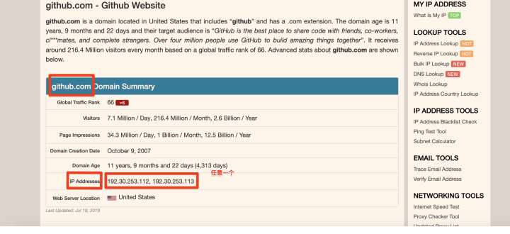
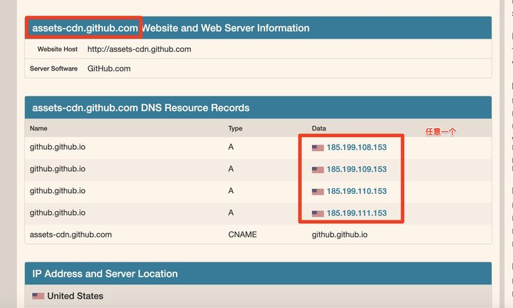
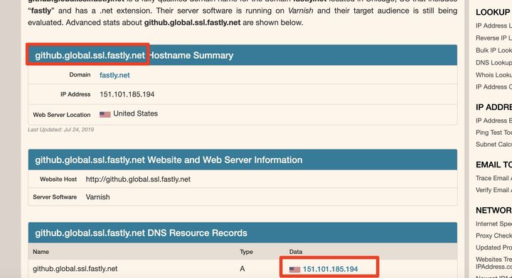

# 1 cdn加速

- 通过修改系统hosts文件的办法，绕过国内dns解析，直接访问GitHub的CDN节点，从而达到github访问加速的目的。不需要海外的服务器辅助。

## 1.1 获取GitHub官方CDN地址

1. 打开网站[IPAddress.com](https://www.ipaddress.com/)

2. 查询以下3个链接的DNS解析地址

   > [github.com](https://github.com/)
   >
   > [assets-cdn.github.com](https://assets-cdn.github.com/)
   >
   > [github.global.ssl.fastly.net](http://github.global.ssl.fastly.net/)

   > [](https://ipaddress.com/website/github.com)
   >
   > [](https://ipaddress.com/website/assets-cdn.github.com) 
   > 
   > [](https://ipaddress.com/website/github.global.ssl.fastly.net) 

## 1.2 修改系统Hosts文件

- Hosts文件所在路径
  - Windows: C:\Windows\System32\drivers\etc
  - Linux: /etc

- 将IP地址和DNS添加到Hosts文件中，添加内容如下（IP需要为1.1中解析的IP地址）:

```
140.82.113.3    github.com
185.199.108.153 assets-cdn.github.com
199.232.69.194  github.global.ssl.fastly.net
```

## 1.3 刷新系统DNS缓存

```
C:\Users\Administrator>ipconfig /flushdns

Windows IP Configuration

Successfully flushed the DNS Resolver Cache.

C:\Users\Administrator>
```

