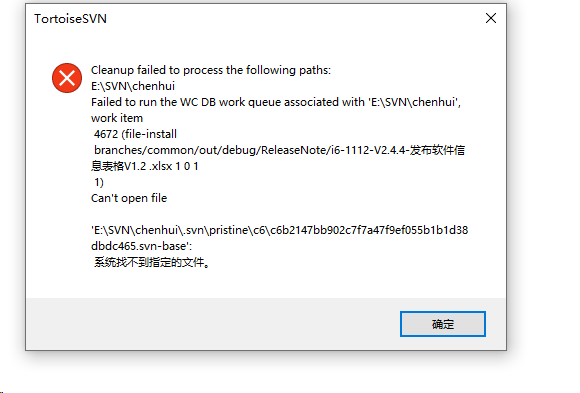
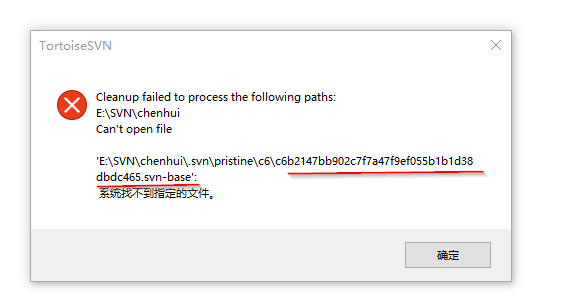

# TortoiseSVN cleanup

## Failed to run the WC DB work queue associated with



使用`Cleanup`，一直报错。

解决方法：清空svn的队列

1. 下载`sqlite`，[sqlite-tools](https://www.sqlite.org/download.html)

2. 解压sqlite-tools，将其目录添加到环境变量

3. 运行`cmd`，进入`.svn`目录

4. 执行如下命令

   ```
   sqlite3 wc.db "select * from work_queue"
   sqlite3 wc.db "delete from work_queue"
   ```

5. 执行`Cleanup`

6. 执行`SVN Update`，如果出现同样的错误，重复3~6

## Can't open file *.svn-base



使用`Cleanup`，一直报错。

解决办法：创建缺失的文件

1. 进入`.svn`对应的目录
2. 创建对应的文件
3. 在执行`Cleanup`成功