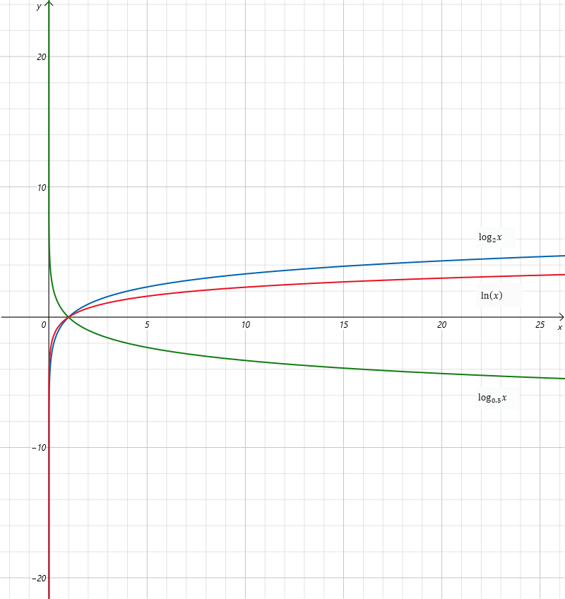

在数学中，**对数**（英语：logarithm）是[幂运算](https://zh.wikipedia.org/wiki/冪)的逆运算。

# 定义
当$x=\beta^y$时，则有
$$
y=\log_\beta{x}
$$

其中$$\beta$$是对数的**底**（也称为基数），而 $$y$$就是$$x$$（对于底数$$\beta$$）的**对数**，$$x$$也称为真数。

底数$$\beta$$的值在实数范围内常取$$e$$、 $$10$$、$$2$$等，但一定不能是1或0。

当$$x$$进一步限制为正实数的时候，对数是唯一的实数。 例如，因为

$$
3^4=3*3*3*3,
$$
我们可以得出

$$
4=\log_3{81},
$$
用日常语言说，即“81以3为底的对数是4”。 这个意思就是说，81是3的4次方。

下图展示了对数的函数图像：

# 对数函数

函数$\log_\alpha{x}$依赖于$\alpha$和$x$两者，但是术语**对数函数**在标准用法中用来称呼形如$\log_\alpha{x}$的函数，在其中底数$\alpha$是固定的，而只有一个参数$\alpha$。

对数函数图像和指数函数图像关于直线$y=x$对称，互为**逆函数**。

对数函数的性质有：

1. 都过$(1,0)$点。
2. $x=0$即$y$为其垂直渐近线。
3. 定义域为$(0,+\infty)$，值域为$\mathbb{R}$。
4. $\alpha>1$，在$(0,+\infty)$上是增函数；$(1>\alpha>0)$时，在$(0,+\infty)$上是减函数。
5. 当$0<\alpha<e^{-e}$时和$y=\alpha^{x}$交于三点；$e^{-e}<\alpha<1$时交于1点；$1<\alpha<e^{1/e}$时交于两点；$\alpha=e^{1/e}$时交于一点；$\alpha>e^{1/e}$时则无交点。**（？证明）**

# 参考

- https://zh.wikipedia.org/wiki/%E5%AF%B9%E6%95%B0